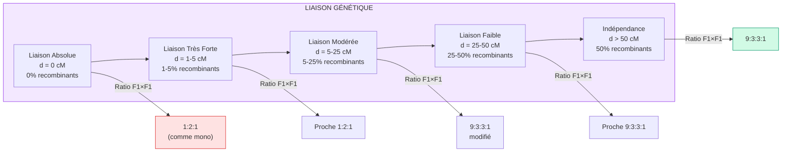
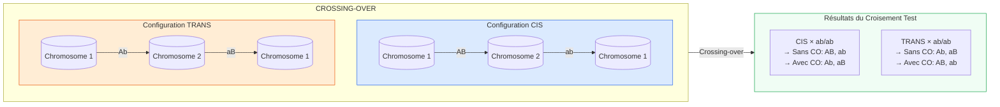
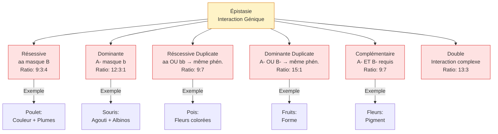
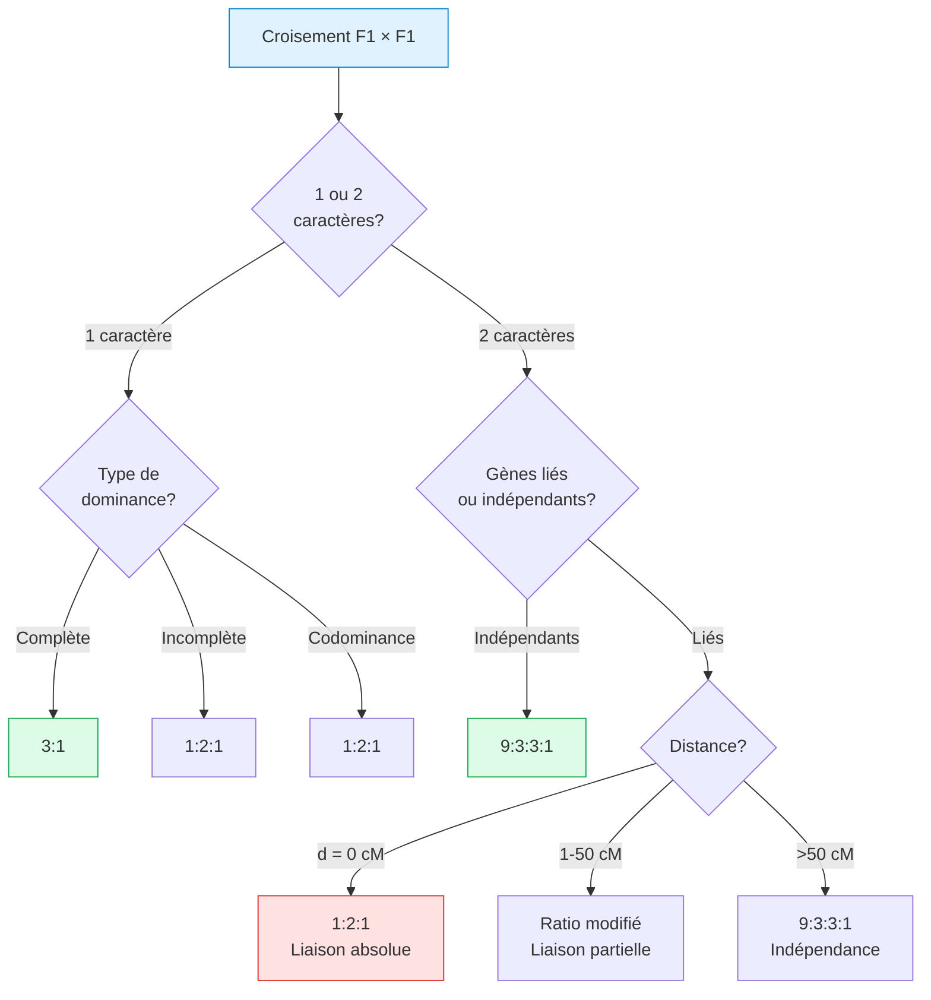

# Graphiques Visuels - Génétique

## Diagramme 1: Arbre des Cas de Croisements

```mermaid
flowchart TD
    A[Croisements<br/>Génétiques] --> B[Monohybridisme<br/>1 Gène]
    A --> C[Dihybridisme<br/>2 Gènes]
    A --> D[Trihybridisme<br/>3 Gènes]
    
    B --> B1[Dominance Complète<br/>3:1]
    B --> B2[Dom. Incomplète<br/>1:2:1]
    B --> B3[Codominance<br/>1:2:1]
    B --> B4[Allèles Multiples<br/>ABO]
    B --> B5[Allèles Léthaux<br/>2:1]
    
    C --> C1[Indépendance<br/>9:3:3:1]
    C --> C2[Liaison Génétique]
    C --> C3[Épistasie]
    
    C2 --> C2a[Liaison Absolue<br/>0 cM → 1:2:1]
    C2 --> C2b[Liaison Partielle<br/>1-50 cM → modifié]
    C2 --> C2c[Indépendance<br/>>50 cM → 9:3:3:1]
    
    C3 --> E1[Récessive<br/>9:3:4]
    C3 --> E2[Dominante<br/>12:3:1]
    C3 --> E3[Réss. Duplicate<br/>9:7]
    C3 --> E4[Dom. Duplicate<br/>15:1]
    C3 --> E5[Complémentaire<br/>9:7]
    C3 --> E6[Double<br/>13:3]
    
    D --> D1[(3:1)³<br/>27:9:9:9:3:3:3:1]
    
    style A fill:#e0f2fe,stroke:#0284c7
    style B fill:#fce7f3,stroke:#db2777
    style C fill:#dcfce7,stroke:#16a34a
    style C3 fill:#fef3c7,stroke:#d97706
```

---

## Diagramme 2: Types de Liaison



---

## Diagramme 3: Configuration CIS vs TRANS



---

## Diagramme 4: Épistasie



---

## Diagramme 5: F1 × F1 selon Configuration



---

## Diagramme 6: Calculs de Probabilités

```mermaid
flowchart TD
    P[Probabilités] --> P1[Monohybridisme<br/>Aa × Aa]
    P --> P2[Dihybridisme<br/>AaBb × AaBb]
    P --> P3[Gènes Liés]
    
    P1 --> P1a[P(dominant) = 3/4]
    P1 --> P1b[P(récessif) = 1/4]
    P1 --> P1c[Ratio: 3:1]
    
    P2 --> P2a[P(A- B-) = 3/4 × 3/4 = 9/16]
    P2 --> P2b[P(A- bb) = 3/4 × 1/4 = 3/16]
    P2 --> P2c[P(aa B-) = 1/4 × 3/4 = 3/16]
    P2 --> P2d[P(aabb) = 1/4 × 1/4 = 1/16]
    P2 --> P2e[Ratio: 9:3:3:1]
    
    P3 --> P3a[P(parental) = (1-d)/2]
    P3 --> P3b[P(recombinant) = d/2]
    P3 --> P3c[d = distance en fraction]
    
    style P fill:#e0f2fe,stroke:#0284c7
    style P1 fill:#fce7f3,stroke:#db2777
    style P2 fill:#dcfce7,stroke:#16a34a
    style P3 fill:#fef3c7,stroke:#d97706
```

---

## Tableau Récapitulatif des Ratios

| Section | Cas | Ratio F2 | Formule |
|---------|-----|----------|---------|
| **A** | Monohybridisme complet | 3:1 | - |
| **A** | Monohybridisme incomplet | 1:2:1 | - |
| **A** | Codominance | 1:2:1 | - |
| **A** | Allèles léthaux | 2:1 | - |
| **B** | Dihybridisme indépendant | 9:3:3:1 | (3:1)² |
| **B** | Liaison absolue | 1:2:1 | - |
| **B** | Liaison partielle | Variable | (d)/2 |
| **B** | Épistasie récessive | 9:3:4 | - |
| **B** | Épistasie dominante | 12:3:1 | - |
| **B** | Épistasie réss. duplicate | 9:7 | - |
| **B** | Épistasie dom. duplicate | 15:1 | - |
| **B** | Épistasie complémentaire | 9:7 | - |
| **B** | Épistasie double | 13:3 | - |
| **D** | Trihybridisme | 27:9:9:9:3:3:3:1 | (3:1)³ |

---

## Formule Générale

Pour **n gènes indépendants** avec dominance complète:

$$\text{Ratio} = (3:1)^n$$

| n | Ratio |
|---|-------|
| 1 | 3:1 |
| 2 | 9:3:3:1 |
| 3 | 27:9:9:9:3:3:3:1 |
| 4 | 81:27:27:27:9:9:9:9:3:3:3:3:1 |

---

*Voir aussi: [[Genetique-Catalogue-Complet]] | [[Genetique-Graph-Complet.canvas]]*
