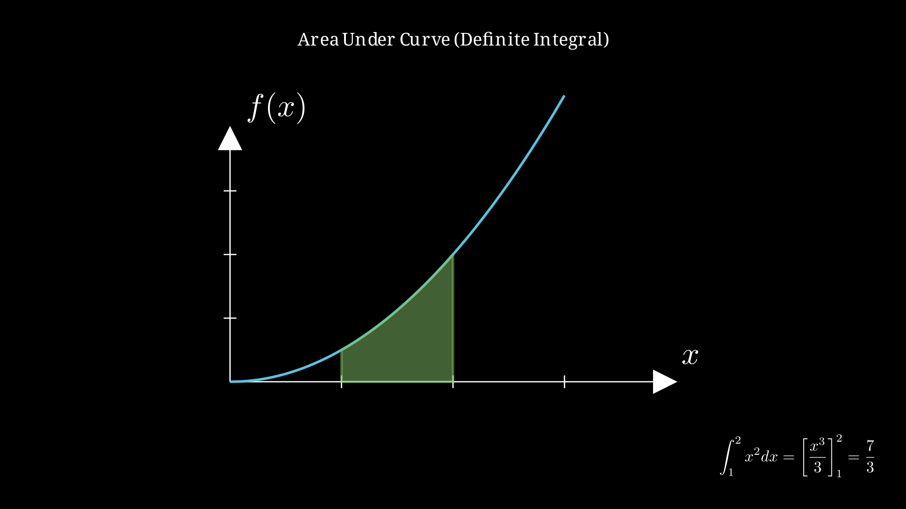

> [!summary] 📊 Note Summary
> 
> | Property | Value |
> |----------|-------|
> | **Difficulty** | `easy` #difficulty/easy |
> | **Formulas** | 0 |
> | **Concepts** | 0 |
> | **Related Notes** | 10 |
> | **Word Count** | 349 |
> | **Last Enhanced** | 2026-03-10 |

## 📊 Note Summary

| Property | Value |
|----------|-------|
| Difficulty | Easy |
| Formulas | 0 |
| Concepts | 0 |
| Related Notes | 10 |
| Word Count | 278 |
| Last Enhanced | 2026-03-10 |

# Integrals - Fundamentals

## Definition
Integration is the reverse process of differentiation. It finds the area under a curve.

## Indefinite Integral
∫ f(x) dx = F(x) + C

Where F'(x) = f(x) and C is the constant of integration

## Definite Integral
∫[a to b] f(x) dx = F(b) - F(a)

Represents the net area between x=a and x=b

## Basic Rules

### Power Rule
∫ x**n dx = (x**n⁺**1)/(n+1) + C  (n ≠ -1)

### Constant Multiple
∫ k·f(x) dx = k·∫ f(x) dx

### Sum/Difference
∫ [f(x) ± g(x)] dx = ∫ f(x) dx ± ∫ g(x) dx

## Common Integrals

| Function | Integral |
|----------|----------|
| ∫ 1 dx | x + C |
| ∫ x**n dx | x**n⁺**1/(n+1) + C |
| ∫ 1/x dx | ln\|x\| + C |
| ∫ e**x dx | e**x + C |
| ∫ a**x dx | a**x/ln(a) + C |
| ∫ sin(x) dx | -cos(x) + C |
| ∫ cos(x) dx | sin(x) + C |
| ∫ sec**2(x) dx | tan(x) + C |

## Fundamental Theorem of Calculus

**Part 1**: If F(x) = ∫[a to x] f(t) dt, then F'(x) = f(x)

**Part 2**: ∫[a to b] f(x) dx = F(b) - F(a)

## Examples

### Example 1
∫ (3x**2 + 2x - 5) dx = x**3 + x**2 - 5x + C

### Example 2
∫[0 to 2] x**2 dx = [x**3/3] from 0 to 2 = 8/3 - 0 = 8/3

## Related
- [[Integrals - Techniques]]
- [[Integrals - Substitution]]
- [[Integrals - Practice Easy]]

## 🔗 Related Notes

- [[QUICK-REFERENCE.md|QUICK-REFERENCE]]
- [[Resource Links.md|Resource Links]]
- [[VAULT-COMPLETION-REPORT.md|VAULT-COMPLETION-REPORT]]
- [[Resource Links.md|Resource Links]]
- [[VAULT-COMPLETION-REPORT.md|VAULT-COMPLETION-REPORT]]
- [[00-Meta/QUICK-START.md|QUICK-START]]
- [[Animations/README.md|README]]
- [[Animations/ALL-EXERCISES-COVERED.md|ALL-EXERCISES-COVERED]]
- [[Animations/ANIMATION_SPEC.md|ANIMATION_SPEC]]
- [[QUICK-REFERENCE.md|QUICK-REFERENCE]]

> [!related] 🔗 Related Notes
> 
> - [[QUICK-REFERENCE.md|QUICK-REFERENCE]]
> - [[Resource Links.md|Resource Links]]
> - [[ANIMATION-SYSTEM-COMPLETE.md|ANIMATION-SYSTEM-COMPLETE]]
> - [[QUICK-REFERENCE.md|QUICK-REFERENCE]]
> - [[ANIMATION-SYSTEM-COMPLETE.md|ANIMATION-SYSTEM-COMPLETE]]
> - [[Animations/ALL-EXERCISES-COVERED.md|ALL-EXERCISES-COVERED]]
> - [[00-Meta/DEEP-CONTENT-STATUS.md|DEEP-CONTENT-STATUS]]
> - [[00-Meta/MOCs/Chemistry MOC.md|Chemistry MOC]]
> - [[01-Concepts/Math/Complex-Numbers/Complex Numbers - Operations.md|Complex Numbers - Operations]]
> - [[Animations/ANIMATION_SPEC.md|ANIMATION_SPEC]]
