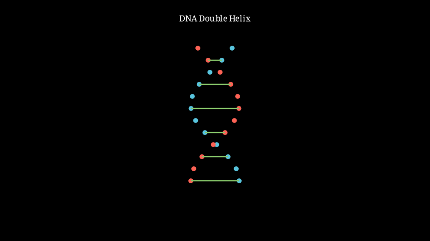

> [!summary] 📊 Note Summary
> 
> | Property | Value |
> |----------|-------|
> | **Difficulty** | `easy` #difficulty/easy |
> | **Formulas** | 0 |
> | **Concepts** | 0 |
> | **Related Notes** | 10 |
> | **Word Count** | 341 |
> | **Last Enhanced** | 2026-03-10 |

## 📊 Note Summary

| Property | Value |
|----------|-------|
| Difficulty | Easy |
| Formulas | 0 |
| Concepts | 0 |
| Related Notes | 10 |
| Word Count | 264 |
| Last Enhanced | 2026-03-10 |

# DNA Structure

## Overview
DNA (Deoxyribonucleic Acid) is the hereditary material that stores genetic information in all living organisms.

## Double Helix Structure

### Components
1. **Nucleotides** (building blocks)
   - Phosphate group
   - Deoxyribose sugar (5-carbon)
   - Nitrogenous base

2. **Nitrogenous Bases**
   - **Purines** (2 rings): Adenine (A), Guanine (G)
   - **Pyrimidines** (1 ring): Cytosine (C), Thymine (T)

### Base Pairing Rules (Chargaff's Rules)
- A pairs with T (2 hydrogen bonds)
- G pairs with C (3 hydrogen bonds)
- **Complementary strands**: If one strand is ATGC, other is TACG

## Structure Features

### Sugar-Phosphate Backbone
- Forms the "sides" of the DNA ladder
- Phosphodiester bonds connect nucleotides
- 5' to 3' directionality

### Antiparallel Strands
- One strand runs 5'  ->  3'
- Other strand runs 3'  ->  5'

### Major and Minor Grooves
- Spaces between backbone spirals
- Allow protein binding

## DNA Organization

### Chromatin
DNA + histone proteins  ->  nucleosomes  ->  chromatin  ->  chromosomes

### Chromosome Structure
- Humans: 46 chromosomes (23 pairs)
- Each chromosome = one long DNA molecule

## Key Measurements
- Width: ~2 nm
- One turn: 10 base pairs, 3.4 nm
- Human genome: ~3 billion base pairs

## Historical Discovery
- Watson & Crick (1953) - Double helix model
- Franklin & Wilkins - X-ray crystallography data

## Related Topics
- [[Genetics - Replication]]
- [[Genetics - Transcription]]
- [[Genetics - Mutations]]

## Resources
- [DNA Learning Center - 3D Structure](https://www.dnalc.org/)
- [Khan Academy - DNA Structure](https://www.khanacademy.org/science/biology/dna-as-the-genetic-material/structure-of-dna/v/dna-structure-and-function)

## 🔗 Related Notes

- [[VAULT-COMPLETION-REPORT.md|VAULT-COMPLETION-REPORT]]
- [[ANIMATION-SYSTEM-COMPLETE.md|ANIMATION-SYSTEM-COMPLETE]]
- [[Animations/ALL-EXERCISES-COVERED.md|ALL-EXERCISES-COVERED]]
- [[QUICK-REFERENCE.md|QUICK-REFERENCE]]
- [[Animations/ALL-EXERCISES-COVERED.md|ALL-EXERCISES-COVERED]]
- [[00-Meta/MOCs/Natural Sciences MOC.md|Natural Sciences MOC]]
- [[Animations/ANIMATION_SPEC.md|ANIMATION_SPEC]]
- [[01-Concepts/Chemistry/Organic/Organic - Functional Groups.md|Organic - Functional Groups]]
- [[04-Exams/BAC-2002-2012/BAC-2002-Normal.md|BAC-2002-Normal]]
- [[00-Meta/QUICK-START.md|QUICK-START]]

> [!related] 🔗 Related Notes
> 
> - [[QUICK-REFERENCE.md|QUICK-REFERENCE]]
> - [[Resource Links.md|Resource Links]]
> - [[ANIMATION-SYSTEM-COMPLETE.md|ANIMATION-SYSTEM-COMPLETE]]
> - [[QUICK-REFERENCE.md|QUICK-REFERENCE]]
> - [[ANIMATION-SYSTEM-COMPLETE.md|ANIMATION-SYSTEM-COMPLETE]]
> - [[Animations/ALL-EXERCISES-COVERED.md|ALL-EXERCISES-COVERED]]
> - [[00-Meta/DEEP-CONTENT-STATUS.md|DEEP-CONTENT-STATUS]]
> - [[00-Meta/MOCs/Chemistry MOC.md|Chemistry MOC]]
> - [[01-Concepts/Math/Complex-Numbers/Complex Numbers - Operations.md|Complex Numbers - Operations]]
> - [[Animations/ANIMATION_SPEC.md|ANIMATION_SPEC]]
