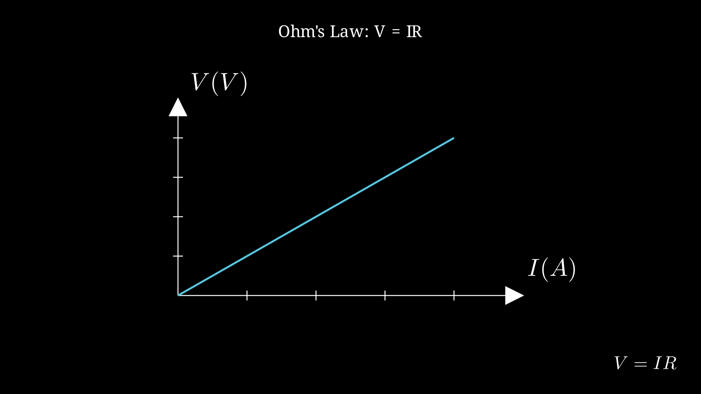

> [!summary] 📊 Note Summary
> 
> | Property | Value |
> |----------|-------|
> | **Difficulty** | `easy` #difficulty/easy |
> | **Formulas** | 0 |
> | **Concepts** | 0 |
> | **Related Notes** | 10 |
> | **Word Count** | 334 |
> | **Last Enhanced** | 2026-03-10 |


## 📊 Note Summary

| Property | Value |
|----------|-------|
| Difficulty | Easy |
| Formulas | 0 |
| Concepts | 0 |
| Related Notes | 10 |
| Word Count | 259 |
| Last Enhanced | 2026-03-10 |


# Ohm's Law

## The Law
The current through a conductor is directly proportional to the voltage and inversely proportional to the resistance.

**Formula**: V = IR



Where:
- V = voltage (volts, V)
- I = current (amperes, A)
- R = resistance (ohms, Ω)

## Triangle Mnemonic
```
    V
   ---
  I | R
```
- V = IR
- I = V/R
- R = V/I

## Power Relations
P = VI = I**2R = V**2/R

Where P = power (watts, W)

## Resistance
R = ρL/A

Where:
- ρ = resistivity (Ω·m)
- L = length (m)
- A = cross-sectional area (m**2)

## Series Circuits
- Same current through all
- Voltages add: V_total = V_1 + V_2 + V_3
- Resistances add: R_total = R_1 + R_2 + R_3

## Parallel Circuits
- Same voltage across all
- Currents add: I_total = I_1 + I_2 + I_3
- Resistances: 1/R_total = 1/R_1 + 1/R_2 + 1/R_3

## Examples

**Example 1**: 12V battery, 4Ω resistor
I = V/R = 12/4 = 3 A

**Example 2**: 2A current, 6Ω resistor
V = IR = 2×6 = 12 V
P = I**2R = 4×6 = 24 W

**Example 3**: Two 6Ω resistors in series
R_total = 6 + 6 = 12 Ω

**Example 4**: Two 6Ω resistors in parallel
1/R_total = 1/6 + 1/6 = 2/6
R_total = 3 Ω

## Related
- [[Circuits - Kirchhoff Laws]]
- [[Circuits - Power]]
- [[Circuits - Practice Easy]]


## 🔗 Related Notes

- [[VAULT-COMPLETION-REPORT.md|VAULT-COMPLETION-REPORT]]
- [[00-Meta/QUICK-START.md|QUICK-START]]
- [[00-Meta/MOCs/Physics MOC.md|Physics MOC]]
- [[Resource Links.md|Resource Links]]
- [[VAULT-COMPLETION-REPORT.md|VAULT-COMPLETION-REPORT]]
- [[Animations/ANIMATION_SPEC.md|ANIMATION_SPEC]]
- [[Resource Links.md|Resource Links]]
- [[ANIMATION-SYSTEM-COMPLETE.md|ANIMATION-SYSTEM-COMPLETE]]
- [[Animations/Biology/README.md|README]]
- [[Resource Links.md|Resource Links]]


> [!related] 🔗 Related Notes
> 
> - [[QUICK-REFERENCE.md|QUICK-REFERENCE]]
> - [[Resource Links.md|Resource Links]]
> - [[ANIMATION-SYSTEM-COMPLETE.md|ANIMATION-SYSTEM-COMPLETE]]
> - [[QUICK-REFERENCE.md|QUICK-REFERENCE]]
> - [[ANIMATION-SYSTEM-COMPLETE.md|ANIMATION-SYSTEM-COMPLETE]]
> - [[Animations/ALL-EXERCISES-COVERED.md|ALL-EXERCISES-COVERED]]
> - [[00-Meta/DEEP-CONTENT-STATUS.md|DEEP-CONTENT-STATUS]]
> - [[00-Meta/MOCs/Chemistry MOC.md|Chemistry MOC]]
> - [[01-Concepts/Math/Complex-Numbers/Complex Numbers - Operations.md|Complex Numbers - Operations]]
> - [[Animations/ANIMATION_SPEC.md|ANIMATION_SPEC]]
