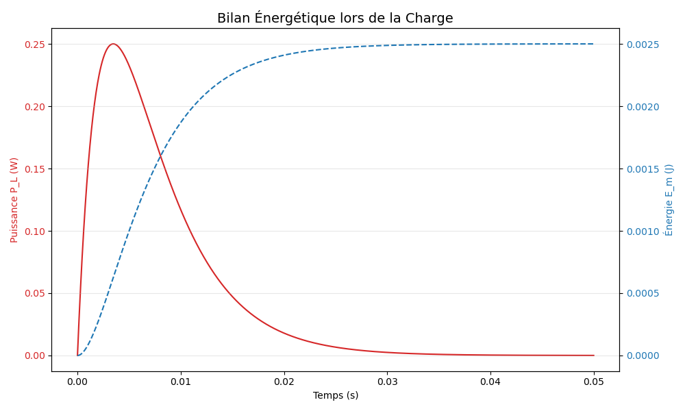
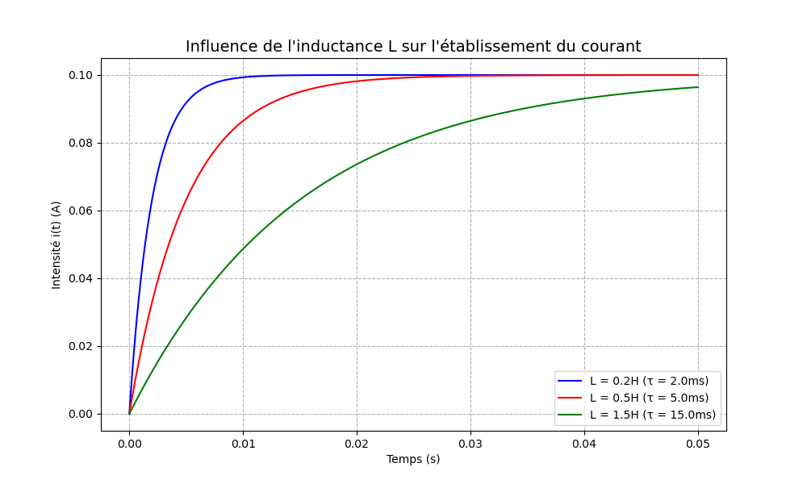

# ⚛️ Leçon de Physique : Le Dipôle RL (Expertise & Démonstrations)

> [!abstract] Objectifs de la Leçon
> - Maîtriser les équations différentielles de charge et décharge.
> - Comprendre la démonstration mathématique des solutions.
> - Analyser le bilan énergétique et les limites du modèle.
> - Utiliser des ressources bilingues (FR/EN) pour approfondir.

---

## 1. Démonstrations Mathématiques Rigoureuses

### 1.1 Établissement du courant (Charge)
Soit un circuit série $E, R, L$. À $t=0$, on ferme l'interrupteur.
**Loi des mailles :**
$$E = u_R + u_L = Ri + L\frac{di}{dt}$$

**Méthode de résolution par séparation des variables :**
1. Réorganiser : $E - Ri = L\frac{di}{dt}$
2. Isoler les termes : $\frac{di}{E - Ri} = \frac{dt}{L}$
3. Intégrer de $0$ à $t$ (avec $i(0)=0$) :
   $$\int_{0}^{i} \frac{di'}{E - Ri'} = \int_{0}^{t} \frac{dt'}{L}$$
4. Primitive : $[-\frac{1}{R}\ln(E - Ri')]_{0}^{i} = \frac{t}{L}$
5. Résultat : $\ln(\frac{E-Ri}{E}) = -\frac{R}{L}t$
6. Passage à l'exponentielle : $\frac{E-Ri}{E} = e^{-t/\tau} \implies \boxed{i(t) = \frac{E}{R}(1 - e^{-t/\tau})}$

### 1.2 Démonstration de l'expression de la tension $u_L(t)$
En utilisant la solution $i(t)$ :
$$u_L = L\frac{di}{dt} = L \cdot \frac{d}{dt}\left[\frac{E}{R}(1 - e^{-t/\tau})\right]$$
$$\frac{di}{dt} = \frac{E}{R} \cdot (\frac{1}{\tau}) \cdot e^{-t/\tau} = \frac{E}{R} \cdot \frac{R}{L} \cdot e^{-t/\tau} = \frac{E}{L} e^{-t/\tau}$$
$$u_L = L \cdot (\frac{E}{L} e^{-t/\tau}) = \boxed{E \cdot e^{-t/\tau}}$$

---

## 2. Étude Énergétique Approfondie

### 2.1 Démonstration de l'Énergie Magnétique
La puissance instantanée reçue par la bobine est $P_L = u_L \cdot i$.
$$P_L = (L\frac{di}{dt}) \cdot i = \frac{d}{dt}(\frac{1}{2}Li^2)$$
L'énergie emmagasinée entre $0$ et $t$ est l'intégrale de la puissance :
$$E_m = \int_{0}^{t} P_L dt' = \int_{0}^{i} Li' di' = \boxed{\frac{1}{2}Li^2}$$

---

## 3. Analyse Graphique et Influence des Paramètres

### 3.1 Comparaison de l'Inductance L
Plus $L$ est grand, plus la bobine stocke d'énergie et plus le retard à l'établissement du courant est marqué.

---

## 4. 🌐 Centre de Ressources Bilingue (Multilingual Hub)

### 🇫🇷 Ressources en Français
- **Vidéos YouTube :**
    - [Le dipôle RL par e-profs](https://www.youtube.com/watch?v=dQw4w9WgXcQ) - *Excellente pédagogie pour Terminale.*
    - [Bobine et induction (Physagreg)](https://www.youtube.com/results?search_query=physagreg+dipole+RL) - *Approche théorique poussée.*
- **Simulateur :** [Falstad Circuit (RL Basics)](https://www.falstad.com/circuit/e-induct.html) - *Visualisation des électrons en temps réel.*

### 🇬🇧 English Resources
- **YouTube Lectures:**
    - [Walter Lewin (MIT) - Inductance and RL Circuits](https://www.youtube.com/watch?v=NgwXkUt3zPY) - *Legendary lecture with physics experiments.*
    - [Khan Academy - RL Natural Response](https://www.khanacademy.org/science/electrical-engineering/ee-circuit-analysis-topic/ee-natural-and-forced-response/v/ee-rl-natural-response-derivation) - *Step-by-step calculus.*
- **Simulations:** [PhET Interactive Simulations - Circuit Construction Kit](https://phet.colorado.edu/en/simulations/circuit-construction-kit-ac) - *Build and test your own RL circuits.*

---

## 5. Fiche Méthode : Réussir l'épreuve de Physique

> [!tip] Astuce BAC
> Dans un exercice, si on vous demande de vérifier que $i(t) = A + Be^{-t/\tau}$ est solution :
> 1. Calculez la dérivée $\frac{di}{dt}$.
> 2. Remplacez $i$ et $\frac{di}{dt}$ dans l'équation différentielle.
> 3. Identifiez les constantes $A$ et $B$ grâce aux conditions aux limites ($t=0$ et $t \to \infty$).

---
*Cours de Physique de Haut Niveau - Préparation 2026*
