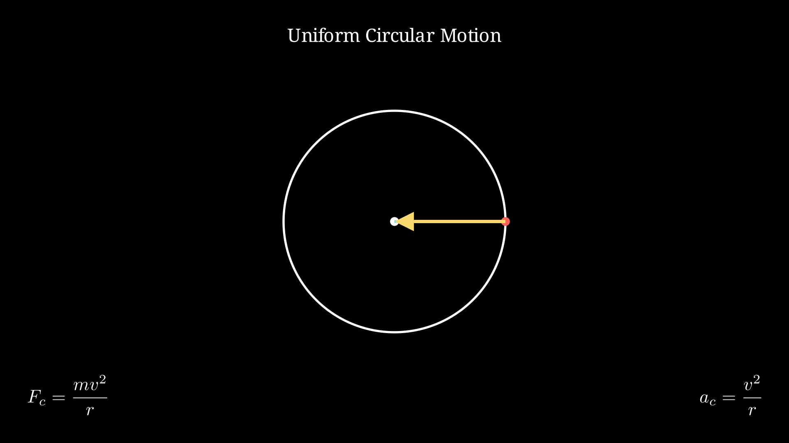

# Dynamics - Circular Motion

## Introduction

Circular motion occurs when an object moves along a circular path. This can be uniform (constant speed) or non-uniform (changing speed).

## Kinematics of Circular Motion

### Angular Quantities

- **Angular displacement**: $\theta$ (radians)
- **Angular velocity**: $\omega = \frac{d\theta}{dt}$ (rad/s)
- **Angular acceleration**: $\alpha = \frac{d\omega}{dt}$ (rad/s²)

### Relationship Between Linear and Angular

$$v = r\omega$$

$$a_t = r\alpha$$

$$a_r = \frac{v^2}{r} = r\omega^2$$

Where:
- $r$ = radius of circular path
- $v$ = linear velocity
- $a_t$ = tangential acceleration
- $a_r$ = radial (centripetal) acceleration

## Uniform Circular Motion

When speed is constant:

- **Velocity**: Constant magnitude, changing direction (tangent to circle)
- **Acceleration**: Purely radial, pointing toward center
- **Period**: Time for one complete revolution: $T = \frac{2\pi r}{v} = \frac{2\pi}{\omega}$
- **Frequency**: Revolutions per second: $f = \frac{1}{T} = \frac{\omega}{2\pi}$

## Centripetal Force

For circular motion, there must be a net force toward the center:

$$F_c = ma_c = \frac{mv^2}{r} = mr\omega^2$$

This is called the **centripetal force** (not a new type of force - it's the net force toward center).

### Sources of Centripetal Force
- Tension in a rope
- Normal force (vertical curves)
- Gravitational force
- Friction (banked curves)
- Magnetic force

## Non-Uniform Circular Motion

When speed changes:

- **Tangential acceleration**: Changes the speed: $a_t = \frac{dv}{dt}$
- **Radial acceleration**: Changes direction: $a_r = \frac{v^2}{r}$
- **Total acceleration**: $\vec{a} = \vec{a}_r + \vec{a}_t$

## Vertical Circular Motion

For an object on a string or in a loop:

### At the Top of a Vertical Circle

$$T_{top} + mg = \frac{mv_{top}^2}{r}$$

Minimum speed at top (where $T_{top} = 0$):
$$mg = \frac{mv_{min}^2}{r} \Rightarrow v_{min} = \sqrt{gr}$$

### At the Bottom of a Vertical Circle

$$T_{bottom} - mg = \frac{mv_{bottom}^2}{r}$$

### At Any Point

$$T - mg\cos\theta = \frac{mv^2}{r}$$

## Graphs and Visualizations

### Uniform Circular Motion

Centripetal force $F_c = \frac{mv^2}{r}$ points toward the center

---

## Examples

### Example 1: Car on Circular Path

A 1000 kg car travels at 20 m/s on a circular track of radius 50 m. Find the centripetal force required.

**Solution:**
$$F_c = \frac{mv^2}{r} = \frac{1000 \times (20)^2}{50} = \frac{1000 \times 400}{50} = 8000 \text{ N}$$

---

### Example 2: Satellite Orbiting Earth

A satellite orbits Earth at altitude where gravitational acceleration is 8 m/s². Its orbital speed is 7000 m/s. Find the radius of the orbit.

**Solution:**
$$g = \frac{v^2}{r} \Rightarrow r = \frac{v^2}{g} = \frac{(7000)^2}{8} = \frac{49 \times 10^6}{8} = 6.125 \times 10^6 \text{ m}$$

---

### Example 3: Banked Curve

A car travels at 15 m/s around a banked curve of radius 100 m. Find the banking angle (no friction).

**Solution:**
$$\tan\theta = \frac{v^2}{rg} = \frac{(15)^2}{100 \times 9.8} = \frac{225}{980} = 0.23$$
$$\theta = \tan^{-1}(0.23) = 13°$$

---

### Example 4: Roller Coaster Loop

A roller coaster enters a vertical loop of radius 20 m at the bottom with speed 25 m/s.

Find:
a) Normal force at bottom
b) Minimum speed at top to complete loop

**Solution:**

a) At bottom: $N - mg = \frac{mv^2}{r}$
$N = m(g + \frac{v^2}{r})$
Let m = 1000 kg: $N = 1000(9.8 + \frac{625}{20}) = 1000(9.8 + 31.25) = 41050 \text{ N}$

b) At top (minimum speed): $v_{min} = \sqrt{gr} = \sqrt{9.8 \times 20} = 14 \text{ m/s}$

---

### Example 5: Conical Pendulum

A mass m = 0.5 kg rotates in a horizontal circle at the end of a string of length 1 m. The string makes a 30° angle with the vertical. Find the speed and tension.

**Solution:**

Radius: $r = L\sin\theta = 1 \times \sin(30°) = 0.5 \text{ m}$

Horizontal (centripetal): $T\sin\theta = \frac{mv^2}{r}$

Vertical: $T\cos\theta = mg$

Dividing: $\tan\theta = \frac{v^2}{rg}$

$$v = \sqrt{rg\tan\theta} = \sqrt{0.5 \times 9.8 \times \tan(30°)} = \sqrt{4.9 \times 0.577} = 1.68 \text{ m/s}$$

$$T = \frac{mg}{\cos\theta} = \frac{0.5 \times 9.8}{\cos(30°)} = \frac{4.9}{0.866} = 5.66 \text{ N}$$

---

## Important Formulas

| Formula | Description |
|---------|-------------|
| $v = r\omega$ | Linear-angular velocity |
| $a_r = v^2/r = r\omega^2$ | Centripetal acceleration |
| $F_c = mv^2/r$ | Centripetal force |
| $T = 2\pi/\omega = 1/f$ | Period |
| $v_{min} = \sqrt{gr}$ | Minimum speed at top of loop |

---

Back to: [[Dynamics MOC]] | [[Physics MOC]]
