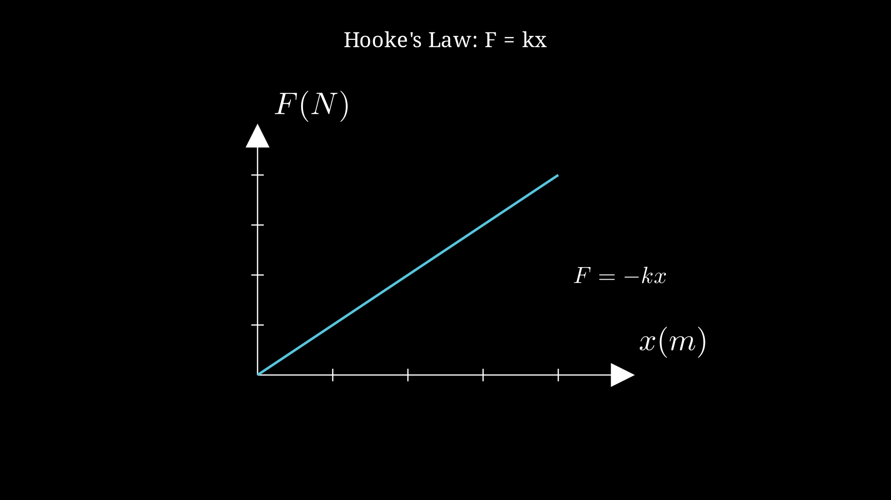
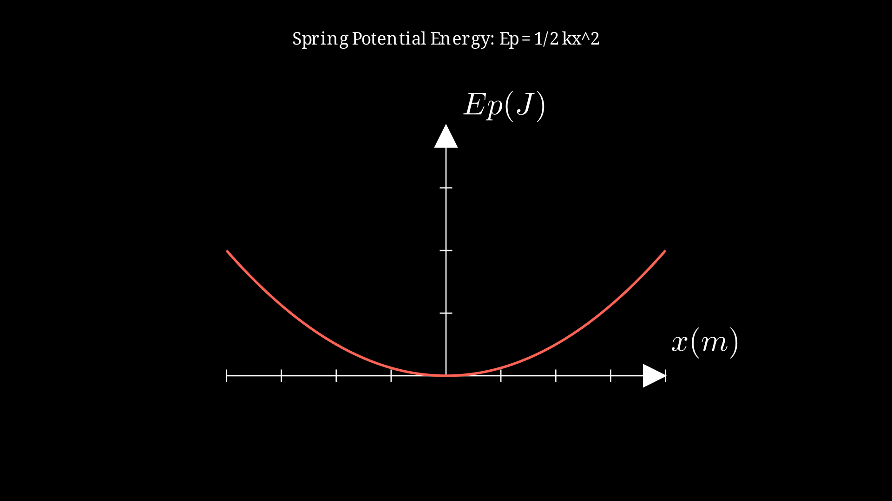
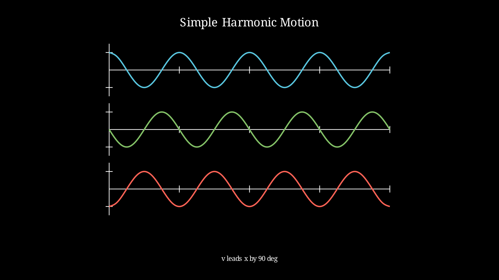
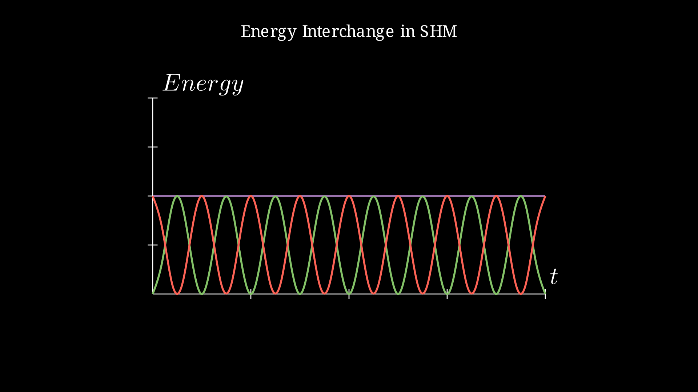
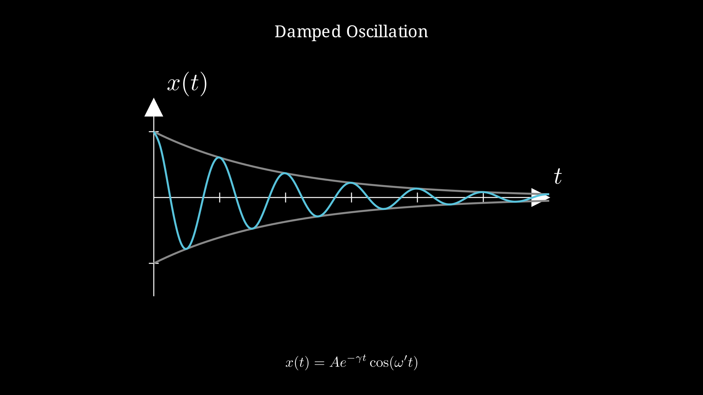

# Dynamics - Springs

## Introduction

Springs are fundamental mechanical components that store energy when deformed and release it when allowed to return to their equilibrium position. They are described by Hooke's Law and are central to understanding simple harmonic motion, a topic critical for the BAC Physics exam.

## Hooke's Law

For an ideal (linear) spring, the restoring force is proportional to the displacement from equilibrium:

$$\vec{F} = -k\vec{x}$$

Where:
- $F$ is the restoring force (N)
- $k$ is the spring constant (N/m)
- $x$ is the displacement from equilibrium (m)
- The negative sign indicates the force opposes displacement

The spring constant $k$ depends on:
- Material properties
- Wire diameter
- Coil diameter
- Number of active coils
- Wire length

## Spring Potential Energy

The work done in stretching or compressing a spring is stored as potential energy:

$$E_p = \frac{1}{2}kx^2$$

This is derived from:
$$W = \int_0^x kx'\,dx' = \frac{1}{2}kx^2$$

## Simple Harmonic Motion of Mass-Spring System

### Period and Frequency

For a mass-spring system (neglecting friction):

$$T = 2\pi\sqrt{\frac{m}{k}}$$

$$f = \frac{1}{T} = \frac{1}{2\pi}\sqrt{\frac{k}{m}}$$

$$\omega = \sqrt{\frac{k}{m}}$$

### Position as Function of Time

$$x(t) = A\cos(\omega t + \phi)$$

Or equivalently:
$$x(t) = A\sin(\omega t + \phi')$$

Where:
- $A$ = amplitude (maximum displacement)
- $\omega$ = angular frequency (rad/s)
- $\phi$, $\phi'$ = phase constant (depends on initial conditions)

### Velocity and Acceleration

$$v(t) = -A\omega\sin(\omega t + \phi)$$

$$a(t) = -A\omega^2\cos(\omega t + \phi) = -\omega^2 x(t)$$

### Energy in Simple Harmonic Motion

**Total Energy:**
$$E = E_k + E_p = \frac{1}{2}mv^2 + \frac{1}{2}kx^2 = \frac{1}{2}kA^2$$

**Kinetic Energy:**
$$E_k = \frac{1}{2}mv^2 = \frac{1}{2}kA^2\sin^2(\omega t + \phi)$$

**Potential Energy:**
$$E_p = \frac{1}{2}kx^2 = \frac{1}{2}kA^2\cos^2(\omega t + \phi)$$

Energy oscillates between kinetic and potential, with total energy remaining constant.

## Vertical Spring Systems

When a spring hangs vertically with a mass attached:

### Equilibrium Position

At equilibrium: $mg = kx_0$

Where $x_0$ is the extension at equilibrium.

### Motion About Equilibrium

Let $y$ be the displacement from equilibrium:
$$m\frac{d^2y}{dt^2} = -ky$$

The period is the same as horizontal:
$$T = 2\pi\sqrt{\frac{m}{k}}$$

The equilibrium position simply shifts the oscillation center.

## Examples

### Example 1: Finding Spring Constant

A 0.5 kg mass stretches a spring by 10 cm. Find the spring constant.

**Solution:**
At equilibrium: $mg = kx_0$
$$k = \frac{mg}{x_0} = \frac{0.5 \times 9.8}{0.1} = 49 \text{ N/m}$$

---

### Example 2: Period of Oscillation

A 2 kg mass is attached to a spring with k = 200 N/m. Find the period.

**Solution:**
$$T = 2\pi\sqrt{\frac{m}{k}} = 2\pi\sqrt{\frac{2}{200}} = 2\pi\sqrt{0.01} = 2\pi \times 0.1 = 0.628 \text{ s}$$

---

### Example 3: Energy in Oscillation

A 0.1 kg mass on a spring (k = 100 N/m) is displaced 5 cm and released. Find:
a) Maximum velocity
b) Total energy
c) Maximum acceleration

**Solution:**

a) At maximum velocity, all energy is kinetic:
$$\frac{1}{2}kA^2 = \frac{1}{2}mv_{max}^2$$
$$v_{max} = A\sqrt{\frac{k}{m}} = 0.05 \times \sqrt{\frac{100}{0.1}} = 0.05 \times 31.6 = 1.58 \text{ m/s}$$

b) Total energy: $E = \frac{1}{2}kA^2 = \frac{1}{2} \times 100 \times (0.05)^2 = 0.125 \text{ J}$

c) Maximum acceleration (at extremes): $a_{max} = \omega^2 A$
$$\omega = \sqrt{\frac{k}{m}} = \sqrt{\frac{100}{0.1}} = 31.6 \text{ rad/s}$$
$$a_{max} = (31.6)^2 \times 0.05 = 50 \text{ m/s}^2$$

---

### Example 4: Vertical Spring (Raja Problem 2024)

A mass m = 100 g is attached to a spring. At equilibrium, the elongation is 10 cm.

Find:
a) The spring constant
b) The period when displaced and released

**Solution:**

a) At equilibrium: $mg = k\Delta l$
$$k = \frac{mg}{\Delta l} = \frac{0.1 \times 9.8}{0.1} = 9.8 \text{ N/m}$$

b) $$T = 2\pi\sqrt{\frac{m}{k}} = 2\pi\sqrt{\frac{0.1}{9.8}} = 2\pi\sqrt{0.0102} = 0.635 \text{ s}$$

---

### Example 5: Two Springs in Series

Two springs with constants $k_1$ and $k_2$ are connected in series. Find the effective spring constant.

**Solution:**

For series combination (same force, total extension):
$$x_{total} = x_1 + x_2 = \frac{F}{k_1} + \frac{F}{k_2} = F\left(\frac{1}{k_1} + \frac{1}{k_2}\right)$$

Effective: $k_{eq} = \frac{F}{x_{total}} = \frac{1}{\frac{1}{k_1} + \frac{1}{k_2}}$

$$\frac{1}{k_{eq}} = \frac{1}{k_1} + \frac{1}{k_2}$$

---

### Example 6: Two Springs in Parallel

Two springs with constants $k_1$ and $k_2$ are connected in parallel. Find the effective spring constant.

**Solution:**

For parallel combination (same displacement, forces add):
$$F_{total} = F_1 + F_2 = k_1 x + k_2 x = (k_1 + k_2)x$$

$$k_{eq} = k_1 + k_2$$

---

## Graphs and Visualizations

### Hooke's Law: Force vs Displacement

$F = kx$ - Linear relationship

---

### Spring Potential Energy

$E_p = \frac{1}{2}kx^2$ - Parabolic relationship

---

### Simple Harmonic Motion

Position, velocity, and acceleration vs time

---

### Energy Interchange

Kinetic and potential energy oscillation

---

### Damped Oscillation

Exponential decay envelope

---

## Damping

In real systems, oscillations gradually decrease due to damping:

### Damped Oscillation Equation

$$m\frac{d^2x}{dt^2} + b\frac{dx}{dt} + kx = 0$$

Where $b$ is the damping coefficient.

### Types of Damping

1. **Underdamped** ($b^2 < 4mk$): Oscillations with decreasing amplitude
   $$x(t) = A e^{-\gamma t} \cos(\omega' t + \phi)$$
   Where $\gamma = b/2m$ and $\omega' = \sqrt{\omega_0^2 - \gamma^2}$

2. **Critically damped** ($b^2 = 4mk$): Returns to equilibrium fastest without oscillating

3. **Overdamped** ($b^2 > 4mk$): Returns to equilibrium without oscillating, but slower than critically damped

## Important Formulas Summary

| Formula | Description |
|---------|-------------|
| $F = -kx$ | Hooke's Law |
| $E_p = \frac{1}{2}kx^2$ | Spring potential energy |
| $T = 2\pi\sqrt{m/k}$ | Period of oscillation |
| $E = \frac{1}{2}kA^2$ | Total mechanical energy |
| $v_{max} = A\sqrt{k/m}$ | Maximum velocity |
| $a_{max} = A\omega^2$ | Maximum acceleration |

## Applications

1. **Shock absorbers**: Damped spring systems in vehicles
2. **Mass measurements**: Spring scales
3. **Timekeeping**: Quartz crystals (similar principle)
4. **Vibration isolation**: Building foundations
5. **Biological systems**: Protein folding, molecular springs

---

Back to: [[Dynamics MOC]] | [[Physics MOC]]
