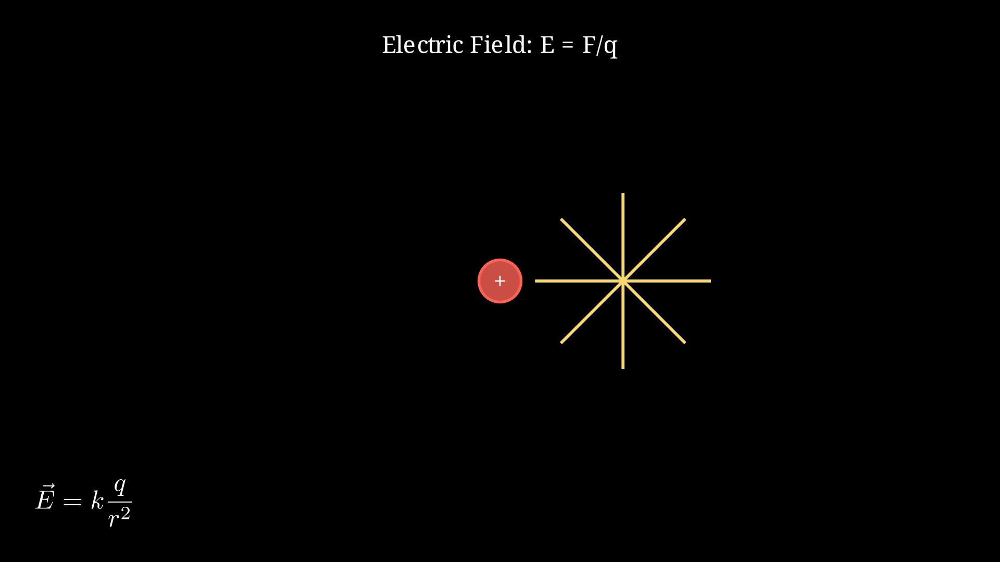

> [!summary] 📊 Note Summary
> 
> | Property | Value |
> |----------|-------|
> | **Difficulty** | `easy` #difficulty/easy |
> | **Formulas** | 0 |
> | **Concepts** | 0 |
> | **Related Notes** | 10 |
> | **Word Count** | 329 |
> | **Last Enhanced** | 2026-03-10 |

## 📊 Note Summary

| Property | Value |
|----------|-------|
| Difficulty | Easy |
| Formulas | 0 |
| Concepts | 0 |
| Related Notes | 10 |
| Word Count | 258 |
| Last Enhanced | 2026-03-10 |

# Electric Fields

## Definition
An electric field is a region of space where an electric charge experiences a force.

**Formula**: E⃗ = F⃗/q

Where:
- E = electric field strength (N/C or V/m)
- F = force on test charge (N)
- q = test charge (C)

## Point Charge Field
E = kQ/r**2

Where:
- k = 8.99×10**9 N·m**2/C**2 (Coulomb's constant)
- Q = source charge (C)
- r = distance from charge (m)

**Direction**: 
- Away from positive charge
- Toward negative charge

## Electric Field Lines

- Start on positive charges
- End on negative charges
- Never cross
- Density indicates field strength

## Superposition Principle
E⃗_total = E⃗_1 + E⃗_2 + E⃗_3 + ...

Vector sum of individual fields

## Uniform Electric Field
E = V/d

Where:
- V = potential difference (V)
- d = distance between plates (m)

## Field of Infinite Plane
E = σ/(2ε_0)

Where:
- σ = surface charge density (C/m**2)
- ε_0 = 8.85×10**{-1}**2 C**2/(N·m**2)

## Electric Dipole
Two equal and opposite charges separated by distance d

Field at distance r >> d:
E ≈ 2kp/r**3

Where p = qd (dipole moment)

## Examples

**Example 1**: Field from 5 μC charge at 0.1 m
E = (9×10**9)(5×10⁻**6)/(0.1)**2 = 4.5×10**6 N/C

**Example 2**: Force on 2 nC charge in 1000 N/C field
F = qE = (2×10⁻**9)(1000) = 2×10⁻**6 N

## Related
- [[EM - Coulomb Law]]
- [[EM - Gauss Law]]
- [[EM - Practice Easy]]

## 🔗 Related Notes

- [[Resource Links.md|Resource Links]]
- [[VAULT-COMPLETION-REPORT.md|VAULT-COMPLETION-REPORT]]
- [[ANIMATION-SYSTEM-COMPLETE.md|ANIMATION-SYSTEM-COMPLETE]]
- [[Resource Links.md|Resource Links]]
- [[VAULT-COMPLETION-REPORT.md|VAULT-COMPLETION-REPORT]]
- [[ANIMATION-SYSTEM-COMPLETE.md|ANIMATION-SYSTEM-COMPLETE]]
- [[Animations/README.md|README]]
- [[Animations/ALL-EXERCISES-COVERED.md|ALL-EXERCISES-COVERED]]
- [[Animations/ANIMATION_SPEC.md|ANIMATION_SPEC]]
- [[00-Meta/QUICK-START.md|QUICK-START]]

> [!related] 🔗 Related Notes
> 
> - [[QUICK-REFERENCE.md|QUICK-REFERENCE]]
> - [[Resource Links.md|Resource Links]]
> - [[ANIMATION-SYSTEM-COMPLETE.md|ANIMATION-SYSTEM-COMPLETE]]
> - [[QUICK-REFERENCE.md|QUICK-REFERENCE]]
> - [[ANIMATION-SYSTEM-COMPLETE.md|ANIMATION-SYSTEM-COMPLETE]]
> - [[Animations/ALL-EXERCISES-COVERED.md|ALL-EXERCISES-COVERED]]
> - [[00-Meta/DEEP-CONTENT-STATUS.md|DEEP-CONTENT-STATUS]]
> - [[00-Meta/MOCs/Chemistry MOC.md|Chemistry MOC]]
> - [[01-Concepts/Math/Complex-Numbers/Complex Numbers - Operations.md|Complex Numbers - Operations]]
> - [[Animations/ANIMATION_SPEC.md|ANIMATION_SPEC]]
