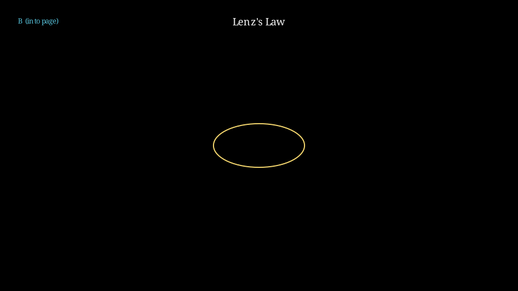

# Induction - Lenz's Law

## Introduction

Heinrich Lenz formulated his law in 1834 as a consequence of energy conservation applied to electromagnetic induction. While Faraday's law gives the magnitude of the induced electromotive force, Lenz's law determines its direction.

## Statement of Lenz's Law

**The direction of an induced current is such that its magnetic effect opposes the change that produced it.**

Alternative statements:
1. The induced magnetic field opposes the change in magnetic flux
2. The induced current flows to oppose the motion or change producing it
3. Nature abhors a change in magnetic flux

## Mathematical Representation

Lenz's law is incorporated into Faraday's law with the negative sign:

$$\mathcal{E} = -\frac{d\Phi_B}{dt}$$

The minus sign indicates that the induced emf produces a current whose magnetic field opposes the change in flux.

## Examples and Applications

### Example 1: Moving Magnet Toward a Loop

When a north pole of a magnet approaches a conducting loop:
1. Magnetic flux through the loop increases
2. An induced current flows to oppose this increase
3. By right-hand rule, this creates a magnetic field pointing away from the approaching magnet
4. Therefore, the induced current flows counterclockwise (viewed from side of approaching magnet)

If the magnet moves away:
1. Magnetic flux decreases
2. Induced current tries to maintain the flux
3. Creates a magnetic field pointing toward the receding magnet
4. Current flows clockwise (viewed from side of receding magnet)

### Example 2: Increasing Current in a Solenoid

Consider a solenoid with increasing current, and a loop surrounding it:
1. Magnetic field inside solenoid increases
2. Magnetic flux through surrounding loop increases
3. Induced current in loop creates field opposing this increase
4. If viewing along axis with current flowing clockwise in solenoid, induced current flows counterclockwise

### Example 3: Moving Conducting Rod

A conducting rod slides on rails in a magnetic field directed into the page:
1. As the rod moves right, area of the loop increases
2. Magnetic flux increases (field into page, area increasing)
3. Induced current must create field out of page to oppose increase
4. By right-hand rule, current flows counterclockwise in the loop

## Energy Considerations

Lenz's law is fundamentally about energy conservation:

### Work Against Induced Forces

When moving a magnet toward a conducting loop, work must be done against the repulsive force (when approaching) or attractive force (when receding) caused by induced currents.

This mechanical work converts to electrical energy dissipated as heat in the loop resistance.

### Eddy Currents Braking

In eddy current brakes:
1. Moving conductor in magnetic field induces currents
2. These currents experience forces opposing the motion
3. Results in braking action with energy converted to heat

## Right-Hand Rule Application

To determine induced current direction:

1. **Identify flux change**: Is magnetic flux increasing or decreasing?
2. **Apply Lenz's law**: Determine field direction needed to oppose change
3. **Use right-hand rule**: Curl fingers in direction of induced current, thumb points in direction of induced field

For solenoids:
- Grip solenoid with right hand
- Extend thumb in direction of required induced field
- Fingers curl in direction of induced current

## Common Scenarios

### Scenario 1: Magnet Entering/Exiting Solenoid

**Magnet entering**:
- Flux increasing
- Induced field opposes magnet field
- Current direction determined by opposition

**Magnet exiting**:
- Flux decreasing
- Induced field supports magnet field
- Opposite current direction compared to entry

### Scenario 2: Switch Closure/Open

**Switch closing**:
- Current builds up, creating increasing flux
- Induced emf opposes current buildup (back emf)

**Switch opening**:
- Current decreases
- Induced emf tries to maintain current (spark suppression)

### Scenario 3: Moving Loop Near Stationary Magnet

**Loop approaching magnet**:
- Flux through loop increases
- Induced current creates opposing field

**Loop receding from magnet**:
- Flux through loop decreases
- Induced current creates supporting field

## Mathematical Validation

Starting with Faraday's law:
$$\mathcal{E} = -\frac{d\Phi_B}{dt}$$

And Ohm's law for the loop:
$$I = \frac{\mathcal{E}}{R} = -\frac{1}{R}\frac{d\Phi_B}{dt}$$

If $\frac{d\Phi_B}{dt} > 0$ (flux increasing), then $I < 0$ (current in direction to oppose)
If $\frac{d\Phi_B}{dt} < 0$ (flux decreasing), then $I > 0$ (current in direction to support)

## Advanced Applications

### Transformers

Lenz's law explains transformer operation:
1. Primary current creates changing flux
2. Secondary induced emf creates current opposing flux change
3. This opposition determines transformer efficiency and voltage ratio

### Motors and Generators

Motor counter emf follows Lenz's law:
- Motor rotation generates emf opposing supply voltage
- Limits current draw and determines efficiency

Generator operation relies on continuous flux variation to maintain emf generation.

## Experimental Verification

Classic experiments include:

### Jump Ring Experiment

1. AC-powered solenoid creates oscillating magnetic field
2. Aluminum ring placed over solenoid experiences repulsive force
3. Ring levitates due to induced currents opposing field changes
4. Demonstrates Lenz's law clearly with visible effects

### Rail Gun Demonstration

1. Conducting bar slides on rails through magnetic field
2. Motion generates emf opposing driving force
3. Required force increases with speed
4. Illustrates energy conservation in induced systems

## Visualization and Memory Aid

Memorize this sequence:

1. **Change**: Identify change in magnetic flux
2. **Opposition**: Determine direction to oppose this change
3. **Application**: Apply right-hand rules to find current direction

Think of Lenz's law as nature's "inertia" for magnetic fields - resisting rapid changes just as physical objects resist acceleration changes.

## Limitations and Misconceptions

### Not Just Opposing Current

Lenz's law doesn't always create opposing *current*, but opposing *flux change*. Sometimes this actually *increases* current if it's decreasing naturally.

### Direction Ambiguity

Always specify the viewing direction or reference frame for current direction discussions.

### Instantaneous vs Average Effects

Lenz's law describes instantaneous effects, though real-world responses have finite time constants due to circuit inductance and resistance.

## Applications Summary

1. **Electromagnetic Braking**: Train brakes, disk brakes
2. **Induction Heating**: Industrial heating, cooktops
3. **Eddy Current Testing**: Material inspection, flaw detection
4. **Shielding**: Magnetic shielding through induced opposing fields

## Mathematical Problem-Solving Approach

### Step-by-step Process:

1. **Define positive directions** for area vector and induced current
2. **Calculate magnetic flux** as a function of time
3. **Differentiate flux** to find rate of change
4. **Apply Faraday-Lenz combination**: $\mathcal{E} = -\frac{d\Phi_B}{dt}$
5. **Determine resulting current direction** using sign convention

### Sign Convention Critical Points:

- Define positive flux direction consistently
- Positive derivative means increasing flux
- Negative induced emf means current opposes increase
- Negative derivative means decreasing flux
- Positive induced emf means current opposes decrease

## Visualizations

![[Induction - Lenz Law.excalidraw]]

---
Back to: [[Magnetic Induction MOC]] | [[Physics MOC]]