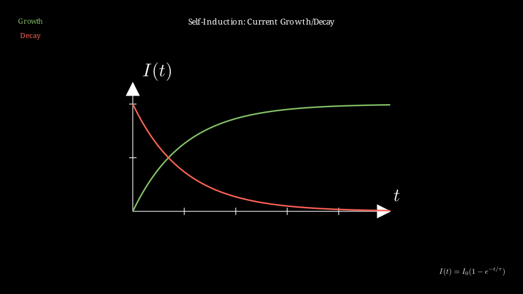

# Induction - Self-Induction

## Introduction

Self-induction is the phenomenon where a changing current in a coil induces an electromotive force (emf) in the same coil. This self-induced emf opposes the change in current, acting according to Lenz's law.

## Self-Inductance

The property of an electrical conductor or circuit that causes an emf to be generated in itself when the current changes is called **self-inductance**.

The relationship is expressed as:
$$\mathcal{E} = -L \frac{dI}{dt}$$

Where:
- $\mathcal{E}$ is the self-induced emf (volts, V)
- $L$ is the self-inductance (henrys, H)
- $\frac{dI}{dt}$ is the rate of change of current (A/s)

The negative sign indicates that the induced emf opposes the change in current (Lenz's law).

## Inductance of a Solenoid

For a long solenoid with:
- $N$ turns
- Length $l$
- Cross-sectional area $A$
- Permeability of core material $\mu$

The self-inductance is:
$$L = \frac{\mu N^2 A}{l}$$

For an air-core solenoid (where $\mu = \mu_0$):
$$L = \frac{\mu_0 N^2 A}{l}$$

Where $\mu_0 = 4\pi \times 10^{-7} \text{ H/m}$ is the permeability of free space.

## Energy Stored in an Inductor

When current flows through an inductor, energy is stored in its magnetic field. The energy stored is:

$$U = \frac{1}{2} L I^2$$

This is analogous to kinetic energy ($\frac{1}{2}mv^2$), where $L$ corresponds to mass and $I$ to velocity.

## Growth and Decay of Current

### Current Growth in RL Circuit

When connecting a battery with emf $\mathcal{E}$ to a series RL circuit:

$$I(t) = \frac{\mathcal{E}}{R}(1 - e^{-t/\tau})$$

Where:
- $\tau = \frac{L}{R}$ is the time constant
- At $t = \tau$: $I = 0.632 \frac{\mathcal{E}}{R}$

### Current Decay in RL Circuit

When disconnecting a battery and shorting the inductor through a resistor:

$$I(t) = I_0 e^{-t/\tau}$$

Where $I_0$ is the initial current.

## Units and Dimensions

- **Henry (H)**: SI unit of inductance
  - $1 \text{ H} = 1 \text{ V·s/A} = 1 \text{ Wb/A}$
- Dimensions: $[L] = ML^2T^{-2}I^{-2}$

## Examples

### Example 1: Solenoid Inductance

Calculate the inductance of a solenoid with:
- Length: 10 cm
- Radius: 2 cm
- Number of turns: 500
- Air core ($\mu_0 = 4\pi \times 10^{-7} \text{ H/m}$)

Area: $A = \pi r^2 = \pi (0.02)^2 = 1.26 \times 10^{-3} \text{ m}^2$

$$L = \frac{\mu_0 N^2 A}{l} = \frac{4\pi \times 10^{-7} \times 500^2 \times 1.26 \times 10^{-3}}{0.1} = 3.95 \times 10^{-4} \text{ H} = 395 \mu\text{H}$$

### Example 2: Induced EMF

A coil has an inductance of 0.5 H. If the current changes from 2 A to 0 A in 0.1 s, find the average induced emf.

$$\mathcal{E} = -L \frac{\Delta I}{\Delta t} = -0.5 \times \frac{0 - 2}{0.1} = 10 \text{ V}$$

The induced emf opposes the decrease in current.

### Example 3: Energy Storage

An inductor stores 50 J when carrying a current of 10 A. Find its inductance.

$$U = \frac{1}{2} L I^2$$
$$50 = \frac{1}{2} L (10)^2$$
$$L = \frac{2 \times 50}{100} = 1 \text{ H}$$

## RL Circuits

RL circuits exhibit characteristic behaviors important in electronics and electrical engineering.

### Time Constant

The time constant $\tau = \frac{L}{R}$ represents:
- Time for current to reach ~63% of final value during growth
- Time for current to fall to ~37% of initial value during decay

### Rise Time

In practical applications, engineers often refer to:
- **10% to 90% rise time**: approximately $2.2\tau$

## Applications

### Chokes

Inductors used to block AC while allowing DC:
- Used in power supplies to smooth rectified AC
- RF chokes block radio frequencies
- Audio frequency chokes block audio frequencies

### Ignition Systems

Automotive ignition systems:
1. Current builds up in primary winding
2. Interrupter breaks circuit suddenly
3. Large $\frac{dI}{dt}$ produces high induced emf in secondary
4. This high voltage creates spark at spark plug

### Fluorescent Lamp Starters

Ballasts in fluorescent lamps:
- Provide necessary starting voltage
- Limit operating current through lamp
- Series inductance acts as current regulator

### Energy Storage

Inductive energy storage in:
- Switch-mode power supplies
- Electric vehicle propulsion systems
- Magnetic energy storage systems

## Mutual Inductance Relation

While studying self-induction helps understand mutual inductance:
- Self-inductance: emf in coil due to its own current change
- Mutual inductance: emf in one coil due to current change in another coil
- Same mathematical form but different coupling mechanisms

## Important Concepts

### Back EMF

When current changes in an inductor:
1. Induced emf opposes change in current
2. Acts like a temporary "battery" opposing the source
3. Called back emf or counter emf

### Steady State vs Transient

For DC circuits with inductors:
- **Transient period**: Current changing, inductor significant effect
- **Steady state**: Current constant, inductor acts like wire

### Skin Effect

At high frequencies:
- Current tends to flow near surface of conductor
- Effective resistance increases
- Inductance appears to increase due to reduced effective area

## Mathematical Details

### Differential Equation for RL Circuit

Applying Kirchhoff's voltage law to series RL circuit:
$$\mathcal{E} - IR - L\frac{dI}{dt} = 0$$

Rearranging:
$$L\frac{dI}{dt} + IR = \mathcal{E}$$

This is first-order linear differential equation with solution:
$$I(t) = \frac{\mathcal{E}}{R}(1 - e^{-Rt/L})$$

### Frequency Domain Analysis

In AC circuits, inductive reactance:
$$X_L = \omega L = 2\pi f L$$

Complex impedance:
$$Z_L = j\omega L$$

Phase relationship: Voltage leads current by 90°.

## Laboratory Measurements

### Inductance Measurement Methods

1. **Bridge circuits**: Similar to measuring capacitance
2. **Resonance method**: LC resonance frequency measurement
3. **Time constant method**: Measuring RL time constant
4. **AC impedance method**: Measuring current/voltage phase relationship

## Practical Considerations

### Real Inductors

Ideal inductors have only inductance. Real inductors also have:
- **Resistance**: Wire resistance
- **Capacitance**: Between windings (inter-turn capacitance)
- **Core losses**: Hysteresis and eddy current losses in ferromagnetic cores

### Quality Factor Q

Quality factor measures efficiency:
$$Q = \frac{\omega L}{R}$$

Higher Q indicates lower losses relative to stored energy.

## Energy Dissipation

While inductors store energy, they also dissipate energy:
1. **Resistive losses**: $I^2R$ losses in wire
2. **Core losses**: Hysteresis and eddy current losses
3. **Radiation losses**: High-frequency electromagnetic radiation

## Safety Considerations

### Energy Release

Inductors can be dangerous because:
- Stored energy can release suddenly
- Breaking circuit can cause high voltage spikes
- Arcing and electrical shock possible
- Fuses and protective circuits recommended in industrial applications

### Snubber Circuits

To protect against voltage spikes:
- Parallel resistor-capacitor networks across switches
- Diodes across relay coils
- Varistors or other surge protection devices

## Visualizations

![[Induction - Self-Induction.excalidraw]]

---
Back to: [[Magnetic Induction MOC]] | [[Physics MOC]]