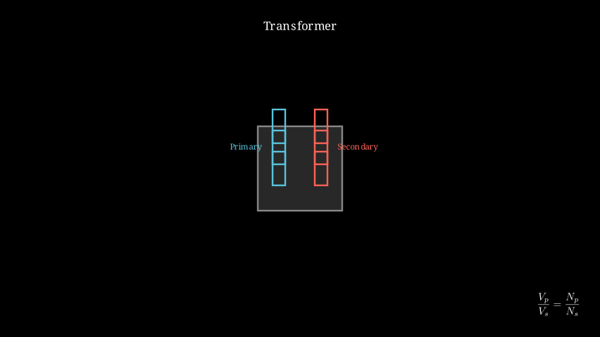

# Induction - Transformers

## Introduction

A transformer is a static electrical device that transfers electrical energy between two or more circuits through electromagnetic induction. It is essential for power transmission and distribution, allowing efficient long-distance transmission of electrical power.

## Transformer Principle

Transformers operate on the principle of Faraday's law of electromagnetic induction. An alternating current in the primary coil creates a changing magnetic field, which induces an alternating voltage in the secondary coil.

$$\mathcal{E}_p = -N_p \frac{d\Phi}{dt}, \quad \mathcal{E}_s = -N_s \frac{d\Phi}{dt}$$

Since both coils experience the same changing flux:

$$\frac{\mathcal{E}_p}{\mathcal{E}_s} = \frac{N_p}{N_s}$$

## Transformer Equation

For an ideal transformer:

$$\frac{V_p}{V_s} = \frac{N_p}{N_s} = \frac{I_s}{I_p}$$

Where:
- $V_p$ = primary voltage (V)
- $V_s$ = secondary voltage (V)
- $N_p$ = number of turns in primary coil
- $N_s$ = number of turns in secondary coil
- $I_p$ = primary current (A)
- $I_s$ = secondary current (A)

## Types of Transformers

### Step-Up Transformer
- $N_s > N_p$
- $V_s > V_p$
- Current decreases: $I_s < I_p$
- Used to increase voltage for long-distance transmission

### Step-Down Transformer
- $N_s < N_p$
- $V_s < V_p$
- Current increases: $I_s > I_p$
- Used to decrease voltage for household use

### Isolation Transformer
- $N_s = N_p$
- $V_s = V_p$
- Used for safety isolation

## Power in Transformers

For an ideal transformer:

$$P_p = P_s$$

$$V_p I_p = V_s I_s$$

Real transformers have losses:
- **Copper losses** ($I^2R$): heating in windings
- **Core losses**: hysteresis and eddy currents
- **Magnetic flux leakage**

Efficiency:

$$\eta = \frac{P_{out}}{P_{in}} \times 100\%$$

Modern transformers achieve 95-99% efficiency.

## Examples

### Example 1: Step-Up Transformer

A transformer has 100 turns in the primary and 1000 turns in the secondary. If the primary voltage is 230 V, find the secondary voltage.

**Solution:**
$$\frac{V_p}{V_s} = \frac{N_p}{N_s} \Rightarrow V_s = V_p \times \frac{N_s}{N_p}$$
$$V_s = 230 \times \frac{1000}{100} = 2300 \text{ V}$$

### Example 2: Step-Down Transformer

A microwave oven transformer steps down 230 V to 23 V. If the primary has 460 turns, how many turns are in the secondary?

**Solution:**
$$\frac{V_p}{V_s} = \frac{N_p}{N_s} \Rightarrow N_s = N_p \times \frac{V_s}{V_p}$$
$$N_s = 460 \times \frac{23}{230} = 46 \text{ turns}$$

### Example 3: Current Transformation

A step-down transformer has 1000 primary turns and 100 secondary turns. If the primary current is 1 A, find the secondary current.

**Solution:**
$$\frac{V_p}{V_s} = \frac{N_p}{N_s} = \frac{I_s}{I_p}$$
$$I_s = I_p \times \frac{N_p}{N_s} = 1 \times \frac{1000}{100} = 10 \text{ A}$$

### Example 4: Power Calculation

A transformer delivers 100 W to a load. If the efficiency is 95%, find the input power and losses.

**Solution:**
$$P_{in} = \frac{P_{out}}{\eta} = \frac{100}{0.95} = 105.3 \text{ W}$$
$$P_{loss} = P_{in} - P_{out} = 105.3 - 100 = 5.3 \text{ W}$$

## Transformer Construction

### Core
- Laminated iron core to reduce eddy currents
- High permeability material to concentrate magnetic flux

### Windings
- Primary and secondary coils
- Usually copper wire
- Insulated from each other and from the core

### Enclosure
- Steel tank for protection
- Oil for cooling and insulation (in oil-filled transformers)

## Real-World Applications

1. **Power Transmission**: Step-up for transmission, step-down for distribution
2. **Chargers**: Phone chargers use small transformers
3. **Audio Equipment**: Audio transformers for impedance matching
4. **Medical Equipment**: Isolation transformers for safety

## Important Formulas Summary

| Formula | Description |
|--------|-------------|
| $\frac{V_p}{V_s} = \frac{N_p}{N_s}$ | Voltage ratio equals turns ratio |
| $\frac{I_p}{I_s} = \frac{N_s}{N_p}$ | Current ratio is inverse of turns ratio |
| $P = VI$ | Power equation |
| $\eta = \frac{P_{out}}{P_{in}}$ | Efficiency |

## Safety Considerations

- Never work on energized transformers
- High voltages can be lethal
- Isolation transformers provide protection against shock
- Proper grounding is essential

---

Back to: [[Magnetic Induction MOC]] | [[Physics MOC]]
