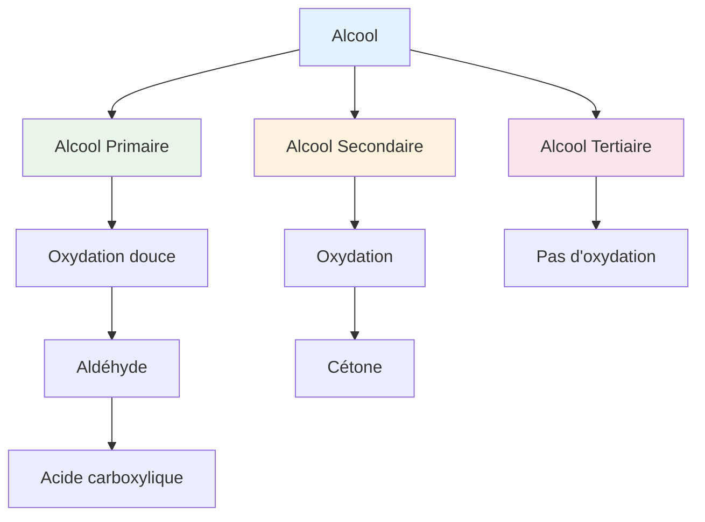

# Série sur les Alcools - 7C

**Établissement**: Lycée de ZOUERATE  
**Année**: 2025-2026  
**Classe**: 7ème C

---

## Exercice 1: Hydratation du but-1-ène

### Questions

1. **Quels alcools** obtient-on par hydratation du but-1-ène ? On donnera leur formule semi-développée, leur nom et leur classe.

2. En fait, il ne se forme pratiquement qu'un seul alcool $A$ lors de cette hydratation. Cet alcool $A$ est oxydé par l'ion dichromate en milieu acide pour donner un composé $B$.
   - Ce composé $B$ réagit avec la 2,4-dinitrophénylhydrazine (DNPH) mais est sans action sur le réactif de Schiff.

   a) **Dans quel but** utilise-t-on la DNPH lors de l'étude d'un composé ? **Qu'observe-t-on** pratiquement lorsque le test est positif ?

   b) **Répondre** aux mêmes questions pour le réactif de Schiff

   c) **Pourquoi** doit-on utiliser successivement ces deux réactifs ?

   d) **Que peut-on affirmation** dans le cas du composé $B$ ? **Quelle** est alors la formule semi-développée de $A$ ?

3. On a écrit, en répondant à la première question, la formule d'un autre alcool $A'$ (qui ne se forme qu'à l'état de traces lors de l'hydratation du but-1-ène).

   **Quels** sont les fonctions et les noms des produits organiques obtenus successivement par oxydation ménagée de ce deuxième alcool $A'$ par l'ion dichromate en milieu acide ? **Écrire** les équations bilans correspondantes.

   On donne : $Cr_2O_7^{2-} / Cr^{3+}$

---

## Exercice 2: *(Suite à compléter)*

---

## Exercice 3: Identification d'un alcool

Afin d'identifier un alcool $A$ de formule brute $C_nH_{2n+2}O$, on prélève deux échantillons de ce même alcool de masses respectives $m_1 = 3,7 \text{ g}$ et $m_2 = 7,4 \text{ g}$ et on réalise les expériences suivantes :

### Expérience 1

La combustion complète de l'échantillon de masse $m_1 = 3,7 \text{ g}$ fournit $8,8 \text{ g}$ de dioxyde de carbone.

a) **Écrire** l'équation générale de la réaction de combustion

b) **Montrer** que la masse molaire de l'alcool $A$ est de la forme $M(A) = 18,5n$

c) **En déduire** la formule brute de $A$

d) **Donner** la formule semi-développée, le nom et la classe de tous les alcools isomères de $A$

### Expérience 2

L'oxydation ménagée de l'échantillon de masse $m_2 = 7,4 \text{ g}$ par une solution de permanganate de potassium ($KMnO_4$) de concentration $C = 0,8 \text{ mol/L}$ donne un composé $B$ qui réagit avec la 2,4-DNPH mais est sans effet sur le réactif de Tollens (nitrate d'argent ammoniacal).

a) **Identifier** $A$ (on précisera sa formule semi-développée et son nom)

b) **Préciser** la formule semi-développée et le nom de $B$

c) **Écrire** l'équation bilan de la réaction d'oxydation qui a eu lieu

---

## Résumé: Oxydation des Alcools

---

## Tests d'Identification

| Réactif | Positif signifie |
|---------|-----------------|
| **DNPH** | Composé carbonylé (aldéhyde ou cétone) → précipité jaune |
| **Schiff** | Aldéhyde → coloration rose |
| **Tollens** | Aldéhyde → argent miroir |

---

## Ressources

- [[Cours Chimie Organique]]
- [[Nomenclature Alcools]]
- [[Oxydation des Alcools]]

---

*Source: Série sur les alcools 7C Lycée de ZOUERATE 2025-2026*