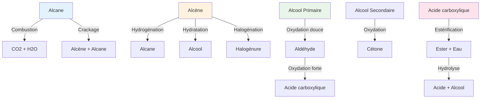

# Chimie Organique - Série 7C/7D

**Établissement**: E.P EL MAARIVA  
**Année**: 2025-2026  
**Classes**: 7ème C & 7ème D

> [!info] Objectif
> Cette série couvre les alcools, les esters, les réactions d'oxydation et d'estérification.

---

## Exercice 1: Détermination de formule brute

Un alcool contient 68,18% de masse de carbone.

1. **Vérifier** que la formule brute de cet alcool est $C_3H_8O$

2. **Donner** les formules semi-développées et les noms des alcools correspondants

> [!tip] Méthode
> - Pourcentage en masse → nombre d'atomes → formule brute
> - Reconnaître les isomères (position du groupement OH)

---

## Exercice 2: Hydratation du but-1-ène

1. **Quels alcools** obtient-on par hydratation du but-1-ène ? On donnera leur formule semi-développée, leur nom et leur classe.

2. En fait, il ne se forme pratiquement qu'un seul alcool $A$ lors de cette hydratation. Cet alcool $A$ est oxydé :
   - Par l'ion dichromate en milieu acidic : compose B → test positif à la DNPH
   - N'agit pas sur le réactif de Schiff

   2.1 **Dans quel but** utilise-t-on la DNPH lors de l'étude d'un composé ?

   2.2 **Qu'observe-t-on** pratiquement lorsque le test est positif ?

   2.3 **Que peut-on affirmation** dans le cas du composé $B$ ? **Quelle** est alors la formule semi-développée de l'alcool $A$ ?

3. On a écrit un autre alcool $A'$ (qui ne se forme qu'à l'état de traces lors de l'hydratation du but-1-ène). **Quels** sont les noms des produits organiques obtenus successivement par oxydation ménagée de l'alcool $A'$ par l'ion dichromate en milieu acide ?

---

## Exercice 3: Isomères et oxydation

1. On considère un mono-alcool aliphatique saturé à chaîne carbonée de masse molaire $M = 88 \text{ g/mol}$.

   **Déterminer** la formule brute de cet alcool, donner la formule semi-développée et le nom de chacun des alcools isomères à chaîne ramifiée correspondant à cette formule.

2. On considère les alcools $A$ et $B$ suivants :
   - $A$ est le 2-méthylpropan-1-ol
   - $B$ est le 3-méthylbutan-1-ol

   L'alcool $A$ est oxydé par une solution de dichromate de potassium. Il donne $A'$ qui réagit avec la DNPH.

   a) **Écrire** l'équation bilan de la réaction d'oxydation et les ions dichromates

   b) L'alcool $B$ réagit avec l'acide éthanoïque pour donner l'éthanoate de butyle $(E)$.

   **Donner** la formule semi-développée et le nom de l'acide $(C)$. **Écrire** l'équation bilan de la réaction.

---

## Exercice 4: Ester et hydrolyse

Un ester $E$ contient 64,6% de carbone et 10,8% d'hydrogène.

1. **Vérifier** que sa formule brute est $C_6H_{12}O_2$

2. L'hydrolyse de $E$ conduit à la formation de deux composés organiques $A$ et $B$.

   a) $A$ est soluble dans l'eau. Sa solution aqueuse conduit le courant électrique et donne une coloration jaune avec le BBT.

   b) $B$ est un composé organique contenant deux atomes de carbone. Il subit une oxydation ménagée pour donner un produit organique $D$ qui contient deux atomes de carbone.

   **Donner** les formules semi-développées de $A$, $B$ et $D$.

---

## Exercice 5: Alcènes et polymères

*(Contenu à compléter)*

---

## Résumé: Réactions en Chimie Organique

---

## Tests d'Identification

| Test | Réactif | Positif signifie |
|------|---------|-----------------|
| DNPH | 2,4-Dinitrophénylhydrazine | Composé carbonylé (aldéhyde ou cétone) |
| Schiff | Réactif de Schiff | Aldéhyde |
| Tollens | Ag(NH3)2+ | Aldéhyde (argent miroir) |
| Ducan | Permanganate de potassium | Alcène ou groupement réducteur |

---

## Ressources

- [[Cours Chimie Organique]]
- [[Nomenclature Alcools]]
- [[Estérification et Hydrolyse]]
- [[Oxydation des Alcools]]

---

*Source: Série chimie organique 7D7C E.P EL MAARIVA 2025-2026*