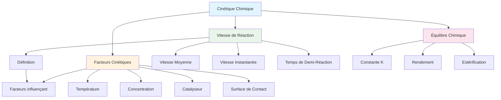

# Cinétique Chimique - Série 7C

**Établissement**: E.P GÉNÉRATION DU FUTUR  
**Année**: 2025-2026  
**Classe**: 7ème C

> [!info] Objectif
> Cette série couvre la cinétique des réactions chimiques, les vitesses de réaction, et les réactions d'estérification.

---

## Exercice 1: Eau oxygénée

On réalise un mélange stœchiométrique de volume total $V = 300 \text{ mL}$ en versant un volume $V_1$ d'une solution d'eau oxygénée.

L'équation bilan qui se produit :
$$2H_2O_2 \rightarrow 2H_2O + O_2$$

### Questions

1. **Donner** la valeur de la quantité de matière initiale de $H_2O_2$

2. **Déterminer** les valeurs de $V_1$, $V_2$, $C_1$

3. **Donner** la composition du mélange réactionnel à $t = 13 \text{ min}$ en $H_2O_2$, $I^-$ et $I_2$

4. **Écrire** les demi-équations électroniques des couples redox mis en jeu

5. **Définir** la vitesse moyenne de disparition de $H_2O_2$ et la calculer entre les instants $t_1 = 0 \text{ min}$ et $t_2 = 14 \text{ min}$

6. **Définir** la vitesse de la réaction et montrer que $v = -\frac{1}{2}\frac{dn(H_2O_2)}{dt}$

---

## Exercice 2: Estérification

### Partie A: Estérification

1. Une des molécules présentes dans l'arôme naturel peut être un ester $E$ de formule semi-développée :
   $$CH_3-CH_2-CH_2-COO-CH_3$$

   a) **Nommer** l'ester $E$

   b) **Écrire** les formules semi-développées de l'acide carboxylique et de l'alcool qui permettent la synthèse de cet ester

   c) **Écrire** l'équation associée à la réaction d'estérification en précisant ses caractéristiques

2. L'ester à odeur de banane se nomme éthanoate de 3-méthylbutyle. Sa formule semi-développée est :
   $$CH_3-COO-CH_2-CH_2-CH(CH_3)_2$$

   Le parfumeur décide de synthétiser cet ester. On utilise un mélange d'acide éthanoïque et d'alcool (3-méthylbutan-1-ol).

   a) **Déterminer** la quantité de matière d'ester non formée à la fin de la réaction

   b) Cette transformation est-elle totale ? **Justifier**

   c) **En déduire** la valeur $K$ de la constante d'équilibre

   d) **Calculer** le rendement de cette réaction

   e) **Comment** peut-on augmenter la valeur du rendement de cette réaction ? (deux réponses demandées)

### Partie B: Réaction redox

On prélève un volume $V_1 = 50 \text{ mL}$ d'une solution d'iodure de potassium ($K^+ + I^-$) de concentration molaire $C_1 = 10^{-1} \text{ mol/L}$ et un volume $V_2 = 75 \text{ mL}$ de peroxodisulfate de potassium de concentration molaire $C_2 = 2 \cdot 10^{-3} \text{ mol/L}$.

On donne les potentiels standards des couples redox :
$$E^0(I_2/I^-) = 0,54 \text{ V} \quad E^0(S_2O_8^{2-}/SO_4^{2-}) = 2,1 \text{ V}$$

1. **Écrire** les demi-équations électroniques et l'équation bilan de la réaction

2. **Calculer** les concentrations initiales des ions iodure $[I^-]_0$ et peroxodisulfate $[S_2O_8^{2-}]_0$. **En déduire** le réactif limitant

3. On étudie la vitesse de formation du diiode $I_2$ en fonction du temps

   a) **Calculer** la vitesse moyenne de formation du diiode entre les instants $t_1 = 10 \text{ min}$ et $t_2 = 55 \text{ min}$

   b) **Déterminer** la vitesse de disparition de l'ion iodure à l'instant $t = 20 \text{ min}$

   c) **Calculer** le temps de demi-réaction

---

## Exercice 3: Réaction entre iodure et peroxodisulfate

On mélange à $t = 0$ et à une température constante :
- $V_1 = 0,1 \text{ L}$ d'une solution $S_1$ d'iodure de potassium ($KI$) de concentration $C_1$
- $V_2 = 0,1 \text{ L}$ d'une solution $S_2$ de peroxodisulfate de potassium ($K_2S_2O_8$) de concentration molaire $C_2$

### Questions

1. **Écrire** l'équation de la réaction en précisant les couples redox mis en jeu

2. **Déduire** de la courbe le nombre de moles de $S_2O_8^{2-}$ dans le mélange et calculer $C_2$

3. a) **Dresser** le tableau d'avancement de la réaction

   b) **Calculer** l'avancement final de la réaction

   c) **Déduire** $C_1$ sachant que le taux d'avancement de la réaction est très proche de 1

4. **Déterminer** la vitesse volumique moyenne de la réaction entre les instants $t = 10 \text{ min}$ et $t = 50 \text{ min}$

5. a) **Définir** la vitesse volumique instantanée de la réaction

   b) **Déterminer** sa valeur à $t = 25 \text{ min}$

   c) **Comment** cette vitesse varie-t-elle au cours du temps ? **Justifier**

6. À un instant $t$, on prélève un volume $V_p = 10 \text{ cm}^3$ du mélange et on dose le diiodeformed par une solution de thiosulfate de sodium ($Na_2S_2O_3$).

---

## Exercices Supplémentaires

- [[Exercices Corrigés Cinétique Chimique]]
- [[Tableau d'Avancement]]
- [[Constante d'Équilibre]]

---

*Source: Série cinétique chimique E.P GÉNÉRATION DU FUTUR 2025-2026*

---

## 📊 Mind Map: Cinétique Chimique

