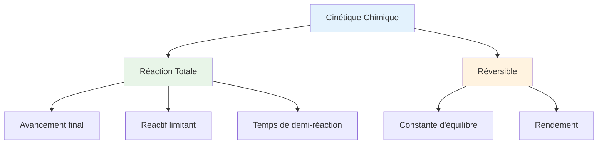

# Sujet de Révision N°1 - 7ème C & D

**Établissement**: El-Itqan  
**Année**: 2021-2022  
**Classes**: 7ème C & 7ème D

---

## Exercice 1: Réaction entre ions iodure et peroxodisulfate (★★★)

On prépare à $t = 0$, un mélange contenant $n_1 = 8 \cdot 10^{-3} \text{ mol}$ d'ion iodure $I^-$ et $n_2$ moles d'ion peroxodisulfate $S_2O_8^{2-}$. Il se produit une réaction totale d'équation :

$$S_2O_8^{2-} + 2I^- \rightarrow I_2 + 2SO_4^{2-}$$

### Questions

1. (a) **Quels** sont les couples rédox mis en jeu dans cette réaction ?

   (b) **Justifier** pourquoi, en présence de l'empois d'amidon, le mélange prend une coloration bleu-noire

   (c) **Dresser** le tableau d'avancement de cette réaction

   (d) **Dresser** le tableau d'avancement volumique de cette réaction

2. L'étude expérimentale a permis de tracer la courbe donnant la variation $n(I^-) = f(t)$ suivante.

   (a) **Quel** est le réactif limitant ? **Justifier**

   (b) **Déterminer** l'avancement final $x_f$ de cette réaction

   (c) **En déduire** la valeur de $n_2$

   (d) **Définir** et **déterminer** le temps de demi-réaction

---

## Partie 2: Cinétique du diiode

On étudie maintenant les variations de la concentration molaire du diiode $I_2$ dans des conditions expérimentales différentes de la partie précédente. Pour cela, le mélange de départ est réparti dans plusieurs erlenmeyer contenant chacun un volume $V_p = 10 \text{ mL}$.

À un instant de date $t$, on refroidit le contenu d'un erlenmeyer, on lui ajoute de l'empois d'amidon puis on dose le diiode formé par une solution $(S)$ de thiosulfate de sodium $(2Na^+ + S_2O_3^{2-})$ de concentration molaire $C = 0,1 \text{ mol/L}$.

### Questions

*(Suite des questions à compléter)*

---

## Exercice 2: *(À compléter)*

---

## Exercice 3: *(À compléter)*

---

## Résumé: Cinétique Chimique

---

## Méthodologie

> [!tip] Points clés
> 1. **Identifier** les couples redox
> 2. **Écrire** l'équation bilan
> 3. **Dresser** le tableau d'avancement
> 4. **Identifier** le réactif limitant
> 5. **Calculer** l'avancement final
> 6. **Déterminer** le temps de demi-réaction

---

## Ressources

- [[Tableau d'Avancement]]
- [[Cinétique Chimique]]
- [[Couples Redox]]

---

*Source: Sujet de revision N°1 - El-Itqan 2021-2022*