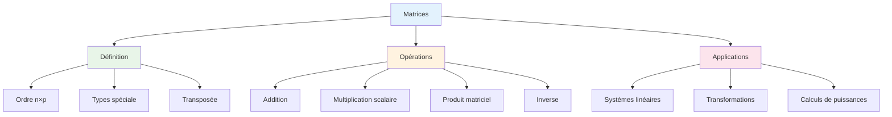

# Cours Matrices - 7C

**Établissement**: E.P ISLAH ERRAID  
**Année**: 2025-2026  
**Classe**: 7ème C

---

## 1. Définition et vocabulaire

Une matrice $n \times p$ est un tableau rectangulaire de nombres à $n$ lignes et $p$ colonnes.

Les nombres qui compose la matrice sont appelés les **éléments** (ou **coefficients**) de la matrice.

Une matrice à $n$ lignes et $p$ colonnes est dite matrice d'ordre $(n, p)$ ou de dimension $n \times p$.

On note $a_{ij}$ le coefficient qui se trouve à la $i^{ème}$ ligne et à la $j^{ème}$ colonne, avec $1 \leq i \leq n$ et $1 \leq j \leq p$.

$$A = \begin{pmatrix} a_{11} & a_{12} & \dots & a_{1p} \\ a_{21} & a_{22} & \dots & a_{2p} \\ \vdots & \vdots & \ddots & \vdots \\ a_{n1} & a_{n2} & \dots & a_{np} \end{pmatrix} = (a_{ij})_{1 \leq i \leq n}^{1 \leq j \leq p}$$

### Cas particuliers

- **Matrice ligne**: une seule ligne (vecteur ligne)
- **Matrice colonne**: une seule colonne (vecteur colonne)
- **Matrice carrée**: autant de lignes que de colonnes

### Types de matrices carrées

| Type | Condition |
|------|-----------|
| **Matrice diagonale** | $a_{ij} = 0$ pour $i \neq j$ |
| **Matrice triangulaire supérieure** | $a_{ij} = 0$ pour $i > j$ |
| **Matrice triangulaire inférieure** | $a_{ij} = 0$ pour $i < j$ |
| **Matrice identité** | $a_{ii} = 1$, $a_{ij} = 0$ pour $i \neq j$ |
| **Matrice nulle** | Tous les coefficients nuls |

### Matrice transposée

La transposée de $A$, notée $A^T$, est obtenue en échangeant les lignes et les colonnes :
- Si $A$ est de dimension $n \times p$, alors $A^T$ est de dimension $p \times n$

---

## 2. Opérations sur les matrices

### a) Addition

Soient $A$ et $B$ deux matrices de même dimension. La matrice $A + B$ est la matrice de même dimension obtained en additionnant les coefficients correspondants.

$$(A + B)_{ij} = a_{ij} + b_{ij}$$

**Propriétés** :
- Commutativité : $A + B = B + A$
- Associativité : $(A + B) + C = A + (B + C)$
- Élément neutre : $A + 0 = A$

### b) Produit par un réel

Soit $\lambda$ un réel. La matrice $\lambda A$ est la matrice obtained en multipliant chaque coefficient par $\lambda$.

$$(\lambda A)_{ij} = \lambda a_{ij}$$

### c) Multiplication de matrices

Soient $A$ une matrice $n \times p$ et $B$ une matrice $p \times q$. Le produit $AB$ est une matrice $n \times q$ définie par :

$$(AB)_{ij} = \sum_{k=1}^{p} a_{ik} b_{kj}$$

> [!warning] Condition
> Le nombre de colonnes de $A$ doit être égal au nombre de lignes de $B$

**Propriétés** :
- Associativité : $(AB)C = A(BC)$
- Distributivité : $A(B + C) = AB + AC$
- Non commutativité : $AB \neq BA$ en général

### d) Inverse d'une matrice

Une matrice carrée $A$ d'ordre $n$ est **inversible** s'il existe une matrice $B$ telle que :
$$AB = BA = I_n$$

$B$ est appelée **matrice inverse** de $A$ et notée $A^{-1}$.

**Critère d'inversibilité** : $\det(A) \neq 0$

---

## 3. Applications des matrices

### a) Systèmes d'équations linéaires

Un système d'équations peut s'écrire sous forme matricielle :
$$AX = B$$

où :
- $A$ est la matrice des coefficients
- $X$ est le vecteur des inconnues
- $B$ est le vecteur des constantes

**Résolution** : Si $A$ est inversible, $X = A^{-1}B$

### b) Transformées linéaires

Les matrices représentent des transformations linéaires dans le plan et l'espace.

### c) Puissance de matrices

Pour calculer $A^k$, on peut diagonaliser $A$ si possible.

---

## 4. Déterminant

Le déterminant d'une matrice carrée $2 \times 2$ :
$$\begin{pmatrix} a & b \\ c & d \end{pmatrix} = ad - bc$$

Pour une matrice $3 \times 3$, on utilise la règle de Sarrus.

**Propriétés** :
- $\det(AB) = \det(A) \times \det(B)$
- $\det(A^T) = \det(A)$
- $\det(kA) = k^n \det(A)$

---

## 5. Rang d'une matrice

Le **rang** d'une matrice est le nombre maximal de lignes (ou colonnes) linéairement indépendantes.

**Propriétés** :
- $\text{rang}(A) = \text{rang}(A^T)$
- Une matrice $n \times n$ est inversible si et seulement si $\text{rang}(A) = n$

---

## Résumé

---

## Ressources

- [[Exercices Matrices]]
- [[Déterminants]]
- [[Systèmes d'Équations]]

---

*Source: Cours matrices 7C E.P ISLAH ERRAID 2025-2026*