# Graphiques et Diagrammes - BAC Physique 7C

Ce fichier contient les représentations visuelles des concepts clés du BAC Physique 2002-2012.

---

## 1. Cinétique Chimique - Décomposition de H₂O₂

### Courbe de Concentration vs Temps

```mermaid
xychart-beta
    title "Évolution de la concentration en H₂O₂ au cours du temps"
    x-axis "Temps (min)" [0, 5, 10, 15, 20, 25, 30]
    y-axis "[H₂O₂] (mol/L)" [0, 0.01, 0.02, 0.03, 0.04, 0.05, 0.06]
    line [0.06, 0.047, 0.037, 0.030, 0.023, 0.018, 0.014]
```

### Schéma de la Réaction

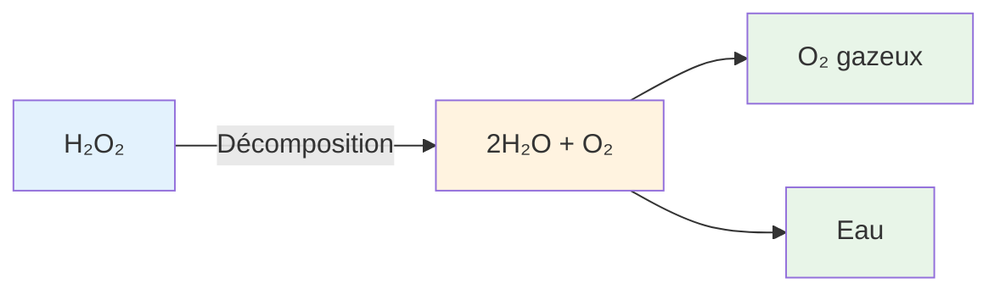

### Vitesse de Réaction

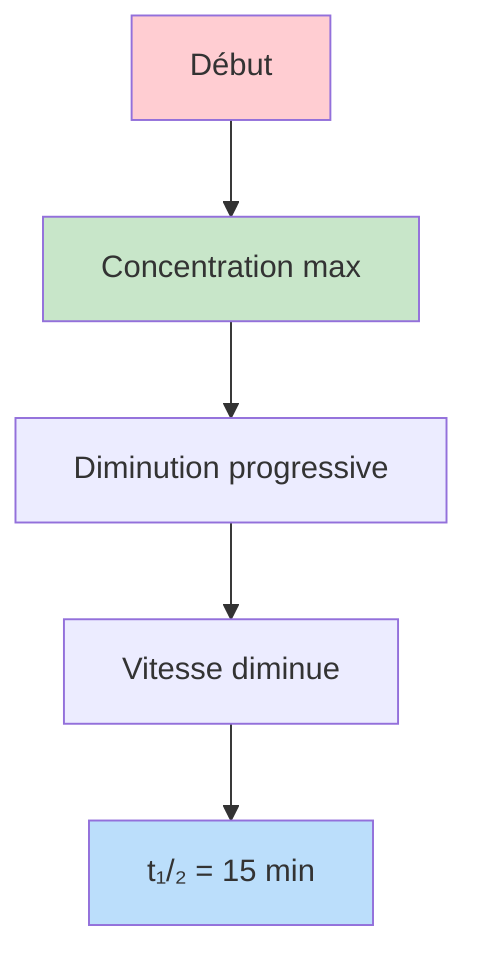

---

## 2. Acides et Bases - Solution Tampon

### Diagramme de Distribution

```mermaid
graph LR
    subgraph Acide faible
    A[AH] -->|Dissociation| B[A⁻] + H⁺
    end
    
    subgraph Équilibre
    B -->|Ka| A
    end
    
    style A fill:#fce4ec
    style B fill:#e1f5fe
```

### Solution Tampon pH = 10.8

```mermaid
flowchart TB
    A[Mélange Acide Fort + Base Faible] --> B[pH = pKa + log(nb/na)]
    B --> C[pKa = 10.8]
    C --> D[Solution Tampon]
    
    style D fill:#c8e6c9
```

---

## 3. Oscillateur Méchanical + Induction

### Montage Expérimental

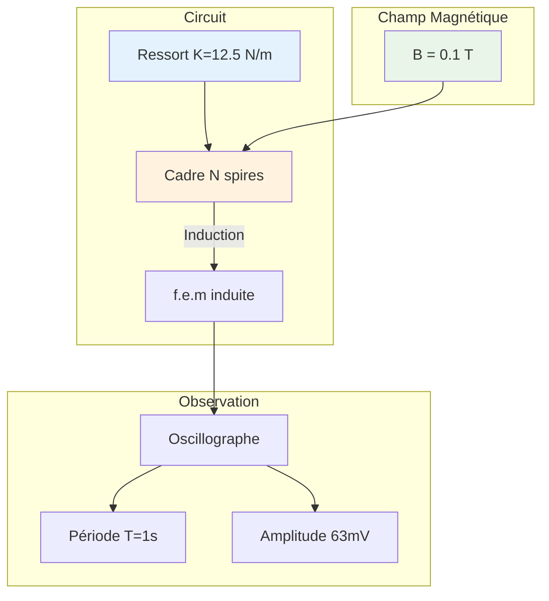

### Oscillation du Cadre

```mermaid
graph LR
    A[Position<br/>d'équilibre] -->|Déplacement x| B[x = Xm cos(ωt + φ)]
    B -->|Vitesse| C[V = -Xmω sin(ωt + φ)]
    C -->|Accélération| D[a = -ω²x]
    
    A -->|ressort| E[Pseudo-période T = 1s]
    
    style A fill:#ffcdd2
    style B fill:#bbdefb
    style E fill:#c8e6c9
```

### Force Électromotrice Induite

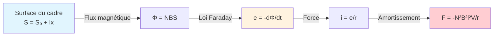

---

## 4. Particules Chargées - Champs Électrique et Magnétique

### Trajectoire dans Champ Électrique

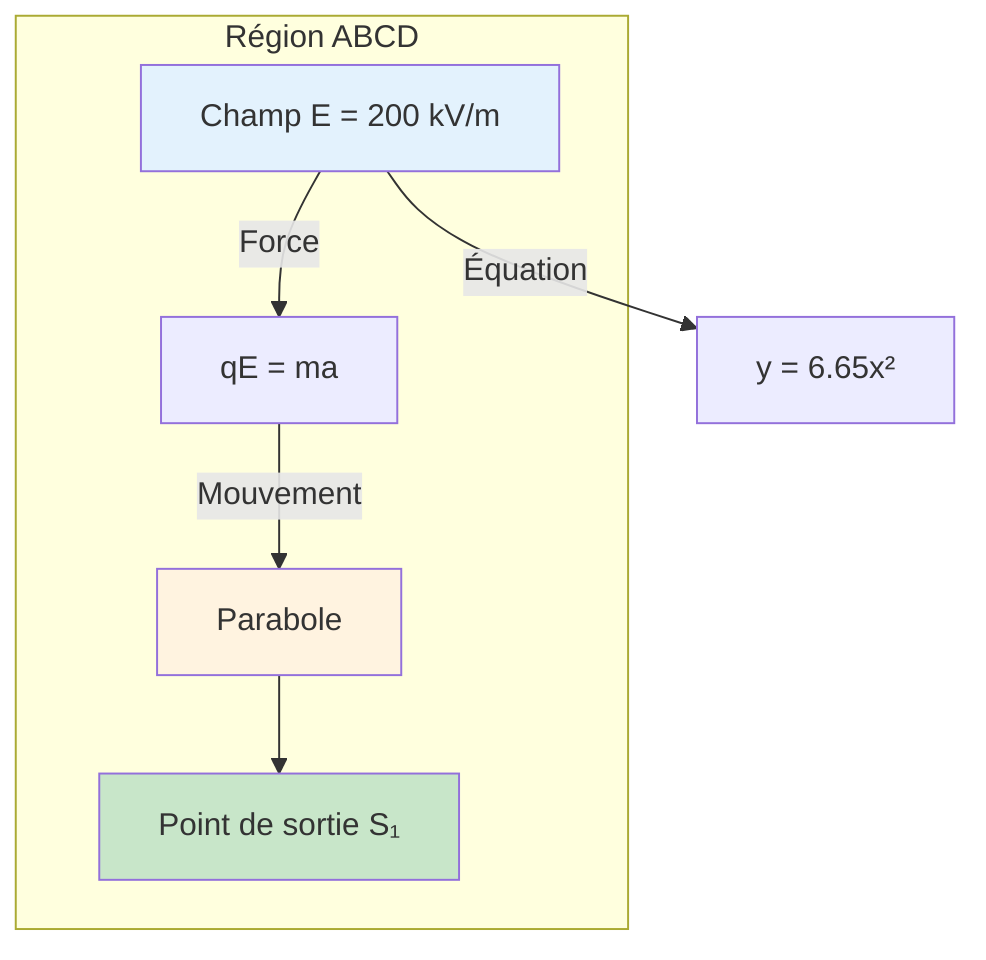

### Trajectoire dans Champ Magnétique

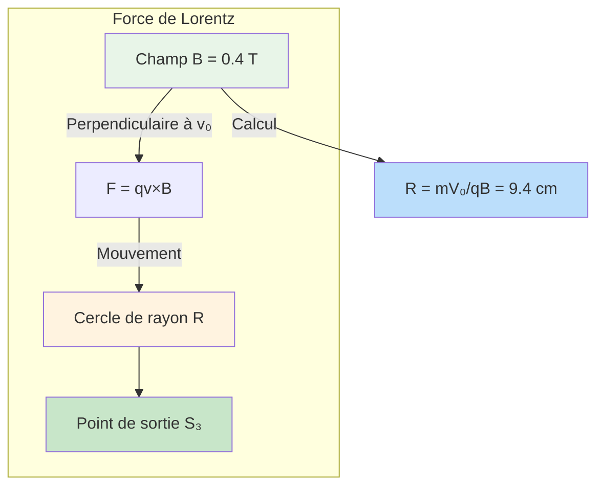

### Trajectoire dans Champ B // à v₀

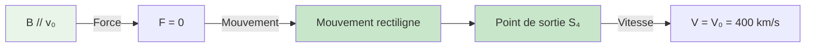

### Récapitulatif des Trois Cas

```mermaid
graph LR
    subgraph Entrée
    V0[Vo = 400 km/s<br/>O(0,0)]
    end
    
    V0 -->|E ↓| E1[Parabole<br/>S₁(8.7cm,5cm)]
    V0 -->|B ⟂| E2[Cercle R=9.4cm<br/>S₃(8.3cm,5cm)]
    V0 -->|B //| E3[Rectiligne<br/>S₄(10cm,0)]
    
    style V0 fill:#e3f2fd
    style E1 fill:#fff3e0
    style E2 fill:#e8f5e8
    style E3 fill:#c8e6c9
```

---

## 5. Dipôles Électriques - Résonance

### Identification des Dipôles

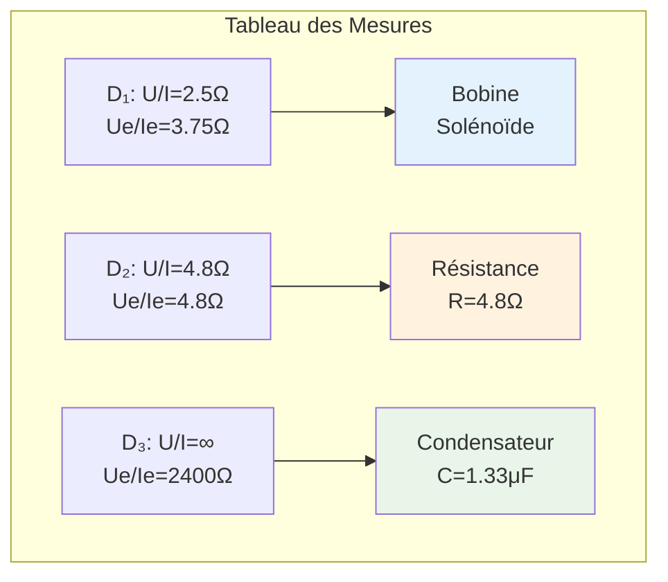

### Circuit RLC Série

```mermaid
flowchart LR
    U[U = 24V] --> R[R]
    R --> L[L]
    L --> C[C]
    C -->|Retour| U
    
    R -->|Impédance| Z[Z = √(R+r)² + (Lω-1/Cω)²]
    
    style U fill:#e3f2fd
    style R fill:#fff3e0
    style L fill:#e8f5e8
    style C fill:#fce4ec
```

### Phénomène de Résonance

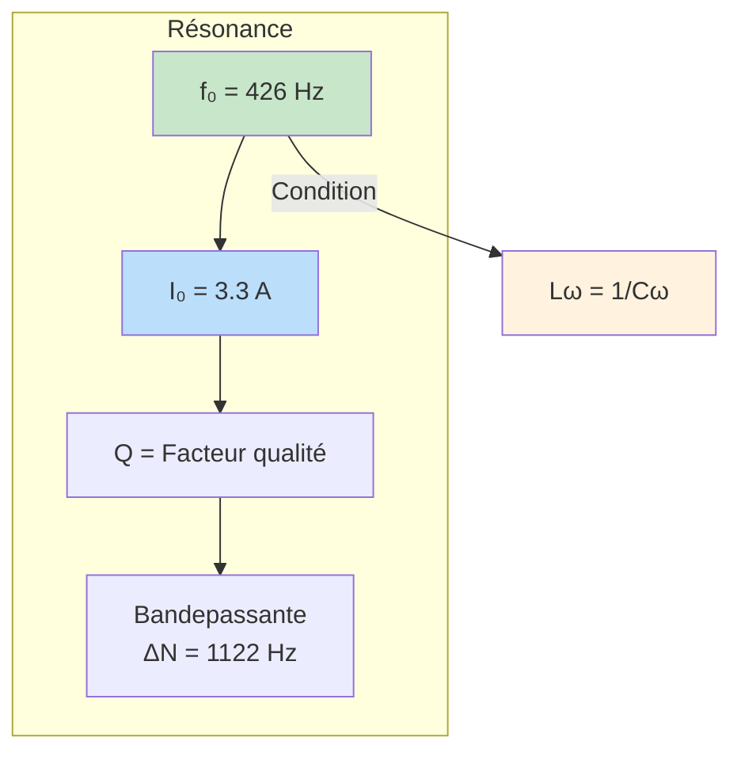

### Déphasages

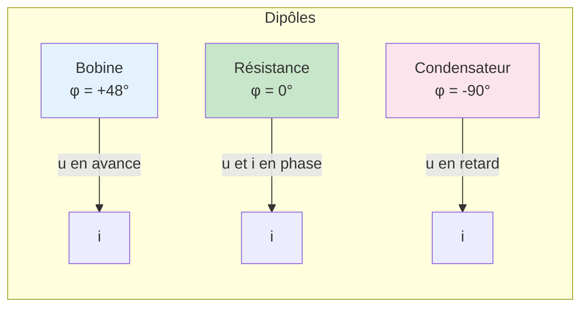

---

## 6. Radioactivité - Carbone 14

### Chaîne de Désintégration

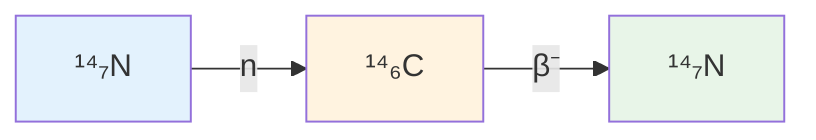

### Courbe de Décroissance radioactive

```mermaid
xychart-beta
    title "Activité du Carbone 14 en fonction du temps"
    x-axis "Temps (ans)" [0, 5600, 11200, 16800, 20000]
    y-axis "Désintégrations/min" [0, 200, 400, 600, 800, 1000, 1200, 1400]
    line [1350, 674, 337, 168, 113]
```

### Calcul de l'Âge

```mermaid
flowchart TB
    A[Formule: A = A₀e^(-λt)] --> B[λ = ln2/T]
    B --> C[λ = 1.24×10⁻⁴ an⁻¹]
    C --> D[197 = 1350×e^(-λt)]
    D --> E[t = 15522 ans]
    
    style E fill:#c8e6c9
```

---

## 7. Mécanique - Piste ABCD

### Vue Schématique

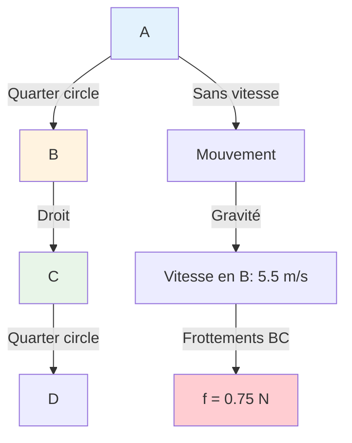

### Sortie de la Piste

```mermaid
graph TD
    C[Point C] -->|Angle α| L[α = 48°]
    L -->|Vitesse| V0[V₀ = 3.2 m/s]
    V0 -->|Direction| Dir[Tangentielle à α = 48°]
    Dir -->|Trajectoire| Parabole[Parabole]
    
    style L fill:#c8e6c9
    style V0 fill:#bbdefb
    style Parabole fill:#fff3e0
```

### Équations du Mouvement

```mermaid
flowchart TB
    eq1[x = V₀cosα × t + Rsinα] -->| avec | eq2[y = -½gt² - V₀sinα × t - R(1-cosα)]
    eq2 -->|Paramétriques| M[Mouvement de chute]
    M -->|Sol| Sol[xD = 1.68m<br/>tD = 0.27s]
    
    style eq1 fill:#e3f2fd
    style eq2 fill:#e3f2fd
    style Sol fill:#c8e6c9
```

---

## 8. Pendule Simple

### Montage

```mermaid
graph TD
    O[O: Point de suspension] -->|Fil l=0.5m| A
    A -->|Bille m=20g| M
    M -->|Écarté α=60°| P[Position initiale]
    P -->|Lâché| E[Équilibre M₀]
    E -->|Vitesse| V[Vm = 2.24 m/s]
    V -->|Énergie| Ec[Ec = 50 mJ]
    
    style O fill:#e3f2fd
    style E fill:#fff3e0
    style V fill:#c8e6c9
```

### Tour Complet

```mermaid
flowchart LR
    V0min[V₀ min pour tour complet] -->|Calcul| V0[V₀ ≥ √(5gl)]
    V0 -->|Valeur| V0calc[V₀ = 5 m/s]
    
    style V0 fill:#bbdefb
    style V0calc fill:#c8e6c9
```

---

## 9. Solénoïde - Induction

### Montage Experimental

```mermaid
graph TD
    S[Solénoïde<br/>l=0.5m<br/>N=1000<br/>L=20mH] -->|Courant| I[I variable]
    I -->|Champ B| B[B = μ₀NI/l]
    B -->|Aiguille| α[α = 45°]
    α -->|Inversion| α2[α = -45°]
    
    style S fill:#e3f2fd
    style B fill:#e8f5e8
    style α fill:#fff3e0
```

### Tension aux Bornes

```mermaid
xychart-beta
    title "Tension aux bornes du solénoïde"
    x-axis "Temps (ms)" [0, 10, 20, 30, 40, 50, 60]
    y-axis "Tension (V)" [-3, -2, -1, 0, 1, 2, 3]
    line [1, 1, 1, 1, 1, -2, -2]
```

---

## 10. Estérification

### Réaction

```mermaid
flowchart LR
    Acide[Acide propanoïque<br/>CH₃CH₂COOH] + Alcool[Propan-2-ol<br/>CH₃CHOHCH₃] -->|Estérification| Ester[Ester + Eau]
    
    style Acide fill:#e3f2fd
    style Alcool fill:#e3f2fd
    style Ester fill:#c8e6c9
```

### Tableau d'Avancement

```mermaid
graph TD
    subgraph Équilibre
    K[K = 4] --> R[Rendement]
    R --> M[Mélange: Ester + Acide + Alcool + Eau]
    end
    
    style K fill:#bbdefb
    style R fill:#c8e6c9
```

---

## Résumé Visuel des Années

```mermaid
graph TD
    2002[2002] --> 2003[2003]
    2002 --> SN1[Session Normale]
    2002 --> SC1[Session Complémentaire]
    
    SN1 --> Ex1[Ex1: Cinétique]
    SN1 --> Ex2[Ex2: Acides/Bases]
    SN1 --> Ex3[Ex3: Oscillateur+Induction]
    SN1 --> Ex4[Ex4: ParticulesChargées]
    SN1 --> Ex5[Ex5: Dipôles+Résonance]
    
    SC1 --> Ex1b[Ex1: Acide faible]
    SC1 --> Ex2b[Ex2: Ester]
    SC1 --> Ex3b[Ex3: Mécanique]
    SC1 --> Ex4b[Ex4: Solénoïde]
    SC1 --> Ex5b[Ex5: Radioactivité]
    
    style 2002 fill:#e3f2fd
    style 2003 fill:#e3f2fd
```

---

*Graphiques générés pour le BAC Physique 7C 2002-2012*