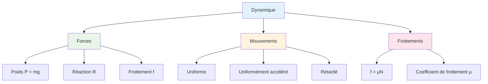

# Série RFD - Physique 7C

**Établissement**: Lycée de ZOUERATE  
**Année**: 2025-2026  
**Classe**: 7ème C

> [!info] Objectif
> Cette série porte sur la dynamique : forces, frottements, mouvement sur plans inclinés.

---

## Exercice 1: Solide sur plan incliné

Un solide $(S)$, de masse $m$ descend le long d'une pente inclinée d'un angle $\alpha$ par rapport au plan horizontal. À $t = 0$, le solide $(S)$ part de $A$ avec une vitesse initiale nulle pour atteindre le point $B$, puis aborde le tronçon $BC$ avec la vitesse $v_B$.

On donne : $AB = L = 2 \text{ m}$; $\alpha = 25°$; $m = 200 \text{ g}$ et $g = 10 \text{ m/s}^2$

### Questions

**Partie A**: On suppose les frottements négligeables sur $AB$

1. **Nomme** les différentes forces qui agissent sur le solide et indique-les sur un schéma

2. **Calcule** l'accélération $a$ du solide puis détermine la nature de son mouvement

3. **Établis** les équations horaires de son mouvement

4. **Calcule** la durée $\Delta t_1$ de la descente

**Partie B**: En réalité, sur $AB$ existent des forces de frottements équivalentes à une force unique $\vec{f}$, colinéaire à $\vec{v}$ et de valeur $f$ constante.

1. **Calcule** $v_i$ au passage en $G_i$ à la date $t_i$, puis complète le tableau

2. **Construis** la courbe $v = f(t)$

3. **Détermine** l'accélération du solide en utilisant la courbe précédente

4. **Calcule** :
   - 4.1) La valeur de $f$
   - 4.2) La vitesse en $B$

**Partie C**: Le solide aborde le plan horizontal $BC$ avec la même accélération qu'en partie B

1. **Calcule** la distance $d$ parcourue sachant que $v_0 = 10 \text{ m/s}$. Détermine la durée $\Delta t_2$ du parcours

---

## Exercice 2: Skieur

Un skieur parcourt une côte inclinée d'un angle $\alpha = 40°$ sur l'horizontale. Au sommet $O$ de cette côte, sa vitesse a pour valeur $v_0 = 12 \text{ m/s}$. Après le point $O$ se présente une descente inclinée d'un angle $\beta = 45°$ sur l'horizontale. Le skieur accomplit un saut et reprend...

*(Suite à compléter)*

---

## Résumé: Dynamique

---

## Formulaire

| Force | Formule |
|-------|---------|
| Poids | $P = mg$ |
| Composante du poids sur le plan | $P_x = mg \sin\alpha$ |
| Composante normale | $P_y = mg \cos\alpha$ |
| Force de frottement | $f = \mu N$ |
| Accélération (sans frottement) | $a = g \sin\alpha$ |
| Accélération (avec frottement) | $a = g(\sin\alpha - \mu\cos\alpha)$ |

---

## Ressources

- [[Cours Dynamique]]
- [[Exercices Corrigés Physique]]
- [[Plans Inclinés]]

---

*Source: Série RFD 7C Lycée de ZOUERATE 2025-2026*