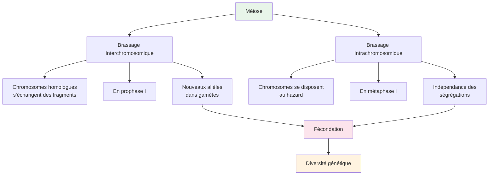
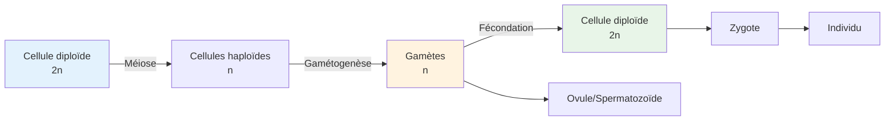

# Brassage de l'Information Génétique - Série 7C

**Établissement**: E.P ERROUWAD KIFFA  
**Année**: 2025-2026  
**Classe**: 7ème C  
**Professeur**: BOWBA Brahim

> [!info] Objectif
> Cette série couvre le brassage génétique inter et intra-chromosomique, la méiose, et la diversité génétique.

---

## Exercice 1: Brassage génétique

La reproduction sexuée, grâce à la méiose et à la fécondation aboutit à une immense diversité génétique, en assurant le brassage des gènes. La méiose, par le brassage inter-chromosomique et intra-chromosomique permet la création de nouvelles combinaisons alléliques dans les gamètes produits.

### Questions

1. **Nommez** les éléments $G_1$ et $G_2$ (documents)

2. **Identifiez** le phénomène illustré par le document 1

3. **Précisez** la conséquence de ce phénomène

4. **Recopiez et complétez** le tableau de comparaison entre le brassage inter et intra-chromosomique

| Critère | Brassage Intrachromosomique | Brassage Interchromosomique |
|---------|---------------------------|---------------------------|
| Cellules concernées | | |
| Phases de déroulement | | |
| Résultats | | |
| Importance génétique | | |

> [!tip] Différence clé
> - **Brassage inter-chromosomique**: échanges entre chromosomes homologues (prophase I)
> - **Brassage intra-chromosomique**: independent assortment (méta phase I)

---

## Exercice 2: Ovogenèse

Les figures du document suivant représentent certaines phases de divisions subies par une cellule germinale au cours d'une étape de l'ovogenèse. Pour simplification des phases, on a représenté 3 paires de chromosomes.

### Questions

1. **Précisez**, en le justifiant, l'étape de l'ovogenèse illustrée par les figures

2. **Donnez** l'ordre chronologique de ces figures

3. **Recopiez et complétez** le tableau suivant :

| Nom de la cellule germinale | | | |
|----------------------------|---|---|---|
| Type de division cellulaire | | | |
| Phase de division | | | |

4. Un autre type de division cellulaire intervient lors de l'ovogenèse. **Précisez** :
   - a) ce type de division
   - b) l'étape correspondante de l'ovogenèse
   - c) son moment dans la vie de la femme
   - d) son lieu de déroulement

---

## Exercice 3: Spermatogenèse

Les cinq figures du document représentent des cellules observées au cours de la même phase de deux types de divisions cellulaires se déroulant au cours de la spermatogenèse. Il y a des figures qui présentent des erreurs. Les chromosomes paternels sont représentés en blanc et les chromosomes maternels en noir.

### Questions

1. **Précisez**, en justifiant la réponse, lesquelles des figures sont incorrectes

2. **Dites**, en justifiant la réponse, quelle étape représente chacune des figures correctes

3. **Quel** phénomène génétique illustre la figure 4 ? **Précisez** son importance

---

## Exercice 4: Caryotype de drosophile

Le document représente la garniture chromosomique d'une drosophile mâle.

### Questions

1. a) **Écrivez** la formule chromosomique correspondant à ce caryotype en précisant le nombre de paires d'autosomes et les types de chromosomes sexuels

   b) **Déduisez** la formule chromosomique des gamètes produits par cet individu

2. a) **Schématisez** une disposition de ces chromosomes en anaphase I

   b) **Citez** les autres dispositions possibles en utilisant les numéros et les lettres

---

## Exercice 5: Crossing-over

*(Contenu à compléter)*

---

## 📊 Schéma: Brassage Génétique

---

## 📊 Tableau: Comparaison Méiose/Mitose

| Critère | Méiose | Mitose |
|---------|--------|--------|
| Nombre de divisions | 2 | 1 |
| Cellules filles | 4 | 2 |
| Chromosomes | Divisé par 2 | Conservé |
| Brassage génétique | Oui | Non |
| Finalité | Gamètes | Croissance/Réparation |

---

## 🔄 Cycle de Reproduction Sexuée

---

## Ressources

- [[Cours Méiose]]
- [[Cours Fécondation]]
- [[Génétique et Hérédité]]
- [[Exercices Corrigés Génétique]]

---

*Source: Série Brassage de l'information génétique 7C E.P ERROUWAD KIFFA 2025-2026*

---

## 📋 Canvas: Brassage Génétique

*Voir fichier canvas associé: [[Brassage-Genetique-Canvas.canvas]]*