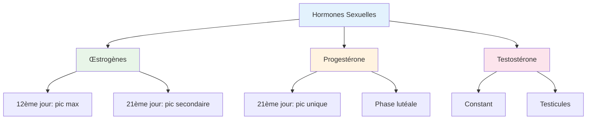

# Résumé sur les Hormones

**Source**: Taki Academy  
**Niveau**: Terminale

---

## 1. Œstrogènes

| Critère | Détail |
|---------|--------|
| **Profil de sécrétion** | 2 pics : grand pic au 12ème jour, petit pic au 21ème jour |
| **Origine** | Thèques internes du follicule tertiaire et granulosa (phase folliculaire), corps jaune (phase lutéale) |
| **Structure cible** | Endomètre, myomètre, col de l'utérus, CS (caractères sexuels) |
| **Effets biologiques** | Prolifération de l'endomètre, développement des CS, contraction du myomètre, glaire filante |

---

## 2. Progestérone

| Critère | Détail |
|---------|--------|
| **Profil de sécrétion** | 1 seul pic au 21ème jour (phase lutéale uniquement) |
| **Origine** | Corps jaune |
| **Structure cible** | Endomètre proliféré, myomètre, col de l'utérus |
| **Effets biologiques** | Maturation de l'endomètre, inhibition des contractions (silence utérin), glaire dense |

---

## 3. Testostérone

| Critère | Détail |
|---------|--------|
| **Profil de sécrétion** | Presque constant |
| **Origine** | Testicule (tissu interstitiel) |
| **Structure cible** | CS (CSI et CSII), testicule, complexe (H.H) |
| **Effets biologiques** | Développement des caractères sexuels, spermatogenèse, RC (-) à forte dose |

---

## Tableau Récapitulatif

---

## Axe Hypothalamo-Hypophysaire

| Hormone | Rôle |
|---------|------|
| **GnRH** | Déclenche la libération de FSH et LH |
| **FSH** | Stimulation folliculaire |
| **LH** | Déclenche l'ovulation et formation du corps jaune |

---

## Cycles Femelle

### Cycle ovarien
- Phase folliculaire (J1-J14)
- Ovulation (J14)
- Phase lutéale (J15-J28)

### Cycle utérin
- Phase menstruelle (J1-J5)
- Phase proliferative (J6-J14)
- Phase secretary (J15-J28)

---

## Ressources

- [[Cours Reproduction]]
- [[Exercices Hormones]]
- [[Cycle Menstruel]]

---

*Source: résumé sur les hormones - Taki Academy*