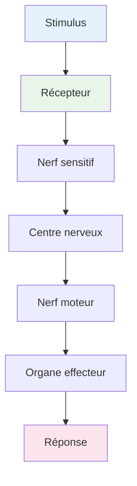

# Système Nerveux - Cours 7ème

**Niveau**: 7ème  
**Année**: 2024

---

## 1. Organisation du système nerveux

### 1.1 Système nerveux central (SNC)

Le système nerveux central comprend :
- **Encéphale** : cerveau, cervelet, bulbe rachidien
- **Moelle épinière**

### 1.2 Système nerveux périphérique (SNP)

- **Nerfs rachidiens** (31 paires)
- **Nerfs crâniens** (12 paires)

### 1.3 Systèmes autonomes

| Système | Fonction |
|---------|----------|
| **Sympathique** | Réaction au stress, accélération cardiaque |
| **Parasympathique** | Repos, digestion, ralentissement |

---

## 2. Nerfs et réflexes

### 2.1 Nerfs de Cyon et Héring

- **Nerf de Cyon** : barorécepteurs carotidiens → baisse de la pression artérielle
- **Nerf de Héring** : mécanorécepteurs cardiaques → régulation de la fréquence cardiaque

### 2.2 Réflexes

- **Réflexe myotatique** : étirement musculaire → contraction
- **Réflexe cardiopalmaire** : variation de la pression → ajustement cardiaque

---

## 3. Contrôle de la pression artérielle

### 3.1 Mécanismes de régulation

1. **Action sur le cœur** : modification de la fréquence cardiaque
2. **Action sur les vaisseaux** : vasoconstriction/vasodilatation
3. **Action sur le volume sanguin** : via l'aldostérone

### 3.2 Système rénine-angiotensine-aldostérone (SRAA)

```
Rénine → Angiotensinogène → Angiotensine I → Angiotensine II → Aldostérone
```

---

## 4. Synapse et transmission nerveuse

### 4.1 Structure de la synapse

- **Bouton présynaptique**
- **Fente synaptique**
- **Bouton postsynaptique**

### 4.2 Transmission synaptique

- **Neurotransmetteurs** : acétylcholine, adrénaline, noradrénaline
- **Potentiel d'action** : signal électrique propagate

---

## Schéma: Voie réflexe



---

## Exercices types

> [!example] QCM
> L'hypotension est corrigée par une :
> a) augmentation de la fréquence des potentiels d'action au niveau des nerfs de Cyon
> b) augmentation de la fréquence des potentiels d'action au niveau des nerfs de Héring
> c) diminution de la fréquence des potentiels d'action au niveau des nerfs parasympathiques cardiaques
> d) augmentation de la fréquence des potentiels d'action au niveau des nerfs sympathiques cardiaques

---

## Ressources

- [[Cours Neurophysiologie]]
- [[Exercices Système Nerveux]]

---

*Source: Système nerveux - Cours 7ème*